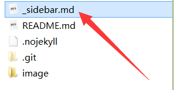

# Docsify工具

### 初识Docsify

##### docsify简介

[docsify](https://docsify.js.org/#/zh-cn/?id=docsify) **是一个动态生成文档网站的工具**。不同于 GitBook、Hexo 的地方是它不会生成将 `.md` 转成 `.html` 文件，所有转换工作都是在运行时进行。

##### 特性

- 无需构建，写完文档直接发布
- 容易使用并且轻量 (~19kB gzipped)
- 智能的全文搜索
- 提供多套主题
- 丰富的 API
- 支持 Emoji
- 兼容 IE10+
- 支持 SSR ([example](https://github.com/docsifyjs/docsify-ssr-demo))

### 准备工作

##### 下载安装Node.js

**[Node.js](https://nodejs.org/zh-cn/)一个基于 Chrome V8 引擎的 JavaScript 运行环境**


**安装好Node.js后，配置环境变量：**

1. 修改用户变量PATH：后面添加`node安装路径\node`。
2. 新增系统变量NODE_PATH：变量值为`node安装路径\node\node_modules`。

打开命令行，输入下面命令，**出现版本号，则说明安装成功**。


##### 安装`docsify-cli`

 `docsify-cli` 工具可以**方便创建及本地预览文档网站**。

```
npm i docsify-cli -g
```

##### 初始化项目

在项目的 `./docs` 目录里写文档，直接通过 `init` 初始化项目。

```
docsify init ./docs
```

初始化后，会在当前路径下生成名称为 `docs` 的文件夹，里面有3个文件。

```
- docs 文件夹
	- .nojekyll 用于阻止 GitHub Pages 会忽略掉下划线开头的文件
	- index.html 入口文件
	- README.md 主页内容渲染(直接编辑README.md就能更新网站主页的内容)
```

**手动初始化**：觉得安装工具太麻烦，可以手动初始化，新建一个 `docs` 文件夹，进入文件夹完成下面操作。

1. 新建一个名称为 `.nojekyll` 的空文件。
2. 新建一个名称为 `index` 的 HTML 文件，添加下面内容：


```html
<!DOCTYPE html>
<html lang="en">
<head>
  <meta charset="UTF-8">
  <title>Document</title>
  <meta http-equiv="X-UA-Compatible" content="IE=edge,chrome=1" />
  <meta name="description" content="Description">
  <meta name="viewport" content="width=device-width, user-scalable=no, initial-scale=1.0, maximum-scale=1.0, minimum-scale=1.0">
  <link rel="stylesheet" href="//unpkg.com/docsify/lib/themes/vue.css">
</head>
<body>
  <div id="app"></div>
  <script>
    window.$docsify = {
      name: '',
    }
  </script>
  <script src="//unpkg.com/docsify/lib/docsify.min.js"></script>
</body>
</html>

```

3. 新建一个名称为 `README` 的 md 文件。

##### 本地预览

运行一个本地服务器通过 `docsify serve` 可以方便的预览效果，而且提供 LiveReload 功能，可以让实时的预览。默认访问 [http://localhost:3000](http://localhost:3000/) 。

```
docsify serve docs
```

### 基础展示

##### 网页名称

```html
<title>网页标签名称</title>
```


##### 封面

**注意：一个文档站点只能有一个封面，即一个仓库一个封面！**

通过修改 `index.html` 文件，设置 `coverpage` 为 `true` 来激活封面功能。

```html
<script>
  window.$docsify = {
    coverpage: true
  }
</script>
<script src="//cdn.jsdelivr.net/npm/docsify/lib/docsify.min.js"></script>
```

设置好以后，**`index.html` 文件会搜索名称为 `_coverpage.md` 文件来作为封面**。我们新建一个`_coverpage.md` 文件添加部分内容：

```


# 个人主页

> 努力，奋斗！

- 上进，上进，还是TMD的上进！

[学习](...)
[积极](...)
[健身](...)
```


默认情况下，背景颜色是随机生成的。您可以自定义背景色或背景图片：

```
<!-- background image -->


<!-- background color -->


```

##### Markdown 扩展

docsify 扩展了一些 Markdown 语法，可以让文档更易读。

**强调内容**：适合显示重要的提示信息，语法为 `!> 内容`。

```
!> 一段重要的内容，可以和其他 **Markdown** 语法混用。
```

!> 一段重要的内容，可以和其他 **Markdown** 语法混用。

普通提示：普通的提示信息，语法为 `?> 内容`。

```
?> _TODO_ 完善示例
```

?> *_TODO_* 完善示例

**图片缩放**：在图片路径后面`'空格:size=宽度x高度'`，即可调整图片展示大小。

```

    即size=100x100
```


##### Corner 挂件

通过修改 `index.html` 文件配置 `repo` 的字符串，会在页面右上角渲染一个 GitHub Corner 挂件。

```html
window.$docsify = {
  repo: 'https://...'
};
```


##### Loading 提示

页面加载时默认会显示 `Loading...` 内容，当然你可以自定义提示信息。

修改`index.html`文件下面内容，这样提示信息就由 `Loading...` 变为 `加载中`。

```html
<div id="app">加载中</div>
```


### 添加功能

##### 边侧栏

首先在 `index.html` 文件中配置 `loadSidebar` 选项：

```html
<script>
  window.$docsify = {
    loadSidebar: true
  }
</script>
<script src="//unpkg.com/docsify"></script>
```

**配好以后，会自动搜索当前路径下名称为 `_sidebar.md` 的文件，作为边侧栏。**`_sidebar.md` 的加载逻辑是从每层目录下获取文件，如果当前目录不存在该文件则回退到上一级目录。例如当前路径为 `/zh-cn/more-pages` 则从 `/zh-cn/_sidebar.md` 获取文件，如果不存在则从 `/_sidebar.md` 获取。

当然你也可以配置 `alias` 避免不必要的回退过程。

```html
<script>
  window.$docsify = {
    loadSidebar: true,
    alias: {
      '/.*/_sidebar.md': '/_sidebar.md'
    }
  }
</script>
```

我们在根目录新建一个名称为 `_sidebar.md` 的文件。



在里面 `_sidebar.md` 文件里面添加**文本文件的超链接的相对地址**。

```
- 目录
  - [符号大全](/1.符号大全.md)
  - [集合](/2.集合.md)
```


边侧栏标题，会显示在侧边栏顶部。

```html
  <script>
    window.$docsify = {
      <!-- 边侧栏顶部标题--> 
      name: 'Math',
    }
  </script>
```


##### 内容标题

文件名称我们已经能在边侧栏中展示了，**展示文件的里面的标题**就需要设置 `subMaxLevel` 配置项了。

```html
<script>
  window.$docsify = {
    loadSidebar: true,
    subMaxLevel: 2
  }
</script>
<script src="//unpkg.com/docsify"></script>
```

`subMaxLevel: 2`**代表只显示2级及以上的标题**。


##### 导航栏

导航栏的配置与边侧栏类似，在 `index.html` 文件中配置 `loadNavbar` 选项：

```html
<script>
  window.$docsify = {
    loadNavbar: true
  }
</script>
```

**配好以后，会自动搜索当前路径下名称为 `_navbar.md` 的文件，作为导航栏。**

我们在根目录新建一个名称为 `_navbar.md` 的文件**添加标题和网址**。

```
* [Python](https://baike.baidu.com/item/Python/407313?fr=aladdin)
* [Go](https://baike.baidu.com/item/go/953521)
```


导航栏中还可以创建子导航：

```
* [Python](https://baike.baidu.com/item/Python/407313?fr=aladdin)
    * [python1](...)
    * [python2](...)
    * [python3](...)
* [Go](https://baike.baidu.com/item/go/953521)
```


##### 夜晚模式

在`index.html`中添加`darkMode`，可调节背景颜色。

```
window.$docsify = {
    darkMode: {
      light: {
        toggleBtnBg: '#42b983'
      }
    }
}
```


### 插件列表

##### 全文搜索

全文搜索插件会**根据当前页面上的超链接获取文档内容**，在 `localStorage` 内建立文档索引。默认过期时间为一天，当然我们可以自己指定需要缓存的文件列表或者配置过期时间。

```html
<script>
  window.$docsify = {
    search: {
      maxAge: 86400000, // 过期时间，单位毫秒，默认一天
      paths: 'auto', // 路径
      placeholder: '搜索', //搜索框默认显示的内容
      noData: '没有结果！', //没有查询结果的显示内容
      // 搜索标题的最大层级, 1 - 6
      depth: 6
    }
  }
</script>
<script src="//unpkg.com/docsify"></script>
<script src="//unpkg.com/docsify/lib/plugins/search.js"></script>
```

##### 表情符号

默认为支持解析表情符号，例如`:100:`将解析为:100:，则需要安装此插件。

```html
<script src="//cdn.jsdelivr.net/npm/docsify/lib/plugins/emoji.min.js"></script>
```

##### 基金标签

通过基金标签ID，在边侧栏上还可以添加基金标签，每次打开页面，标签会自动变化。

```html
window.$docsify = {
  plugins: [
    DocsifyCodefund.create('fae1f9a4-870c-4c25-b8e0-c80464f7a95c') 
  ]
}
<script src="//cdn.jsdelivr.net/npm/docsify/lib/docsify.min.js"></script>
<script src="//cdn.jsdelivr.net/npm/docsify-pagination/dist/docsify-pagination.min.js"></script>
```


##### 图片展示

图片展示插件基于 [medium-zoom](https://github.com/francoischalifour/medium-zoom)，点击图片可单独展示。

```html
<script src="//unpkg.com/docsify/lib/plugins/zoom-image.js"></script>
```

##### 代码高亮

内置的代码高亮工具是 [Prism](https://github.com/PrismJS/prism)，默认支持 CSS、JavaScript 和 HTML。如果需要高亮其语言——例如 PHP——可以手动引入代码高亮插件。

```html
<script src="//unpkg.com/docsify"></script>
<script src="//unpkg.com/prismjs/components/prism-bash.js"></script>
<script src="//unpkg.com/prismjs/components/prism-php.js"></script>
```

##### 公式渲染

*KaTeX* 数学公式渲染库：

```html
<link rel="stylesheet" href="//cdn.jsdelivr.net/npm/katex@latest/dist/katex.min.css"/>
<script src="//cdn.jsdelivr.net/npm/docsify-katex@latest/dist/docsify-katex.js"></script>
```

##### 主题

官方提供了4套主题，可任意选择：

```html
<!--绿色主题，白色背景，黑色字体，绿色挂件(默认)-->
<link rel="stylesheet" href="//cdn.jsdelivr.net/npm/docsify/lib/themes/vue.css">
<!--蓝色主题，白色背景，黑色字体，蓝色挂件-->
<link rel="stylesheet" href="//cdn.jsdelivr.net/npm/docsify/lib/themes/buble.css">
<!--黑暗主题，黑色背景，白色字体，红色挂件-->
<link rel="stylesheet" href="//cdn.jsdelivr.net/npm/docsify/lib/themes/dark.css">
<!--纯净主题，白色背景，黑色字体，黑色挂件-->
<link rel="stylesheet" href="//cdn.jsdelivr.net/npm/docsify/lib/themes/pure.css">
```

### 代码部署

##### 我的封面

加载封面`index.html`文件：

```html
<!DOCTYPE html>
<html lang="en">
<head>
  <meta charset="UTF-8">
  <!--网页名称-->
  <title>Home</title>
  <meta http-equiv="X-UA-Compatible" content="IE=edge,chrome=1" />
  <meta name="description" content="Description">
  <meta name="viewport" content="width=device-width, user-scalable=no, initial-scale=1.0, maximum-scale=1.0, minimum-scale=1.0">
  <link rel="stylesheet" href="//unpkg.com/docsify/lib/themes/vue.css">
</head>
<body>
  <!--等待加载的显示内容-->
  <div id="app">加载中...</div>
<script>
  window.$docsify = {
    <!--加载封面-->
    coverpage: true
  }
</script>
  <!--基础框架-->
  <script src="//unpkg.com/docsify/lib/docsify.min.js"></script>
  <!--封面-->
  <script src="//cdn.jsdelivr.net/npm/docsify/lib/docsify.min.js"></script>
</body>
</html>
```

封面的主要内容是加载`_coverpage.md`文件，我的封面文件：

```html


# JackChen

> 但行好事，莫问前程！

* Document知识库：Markdown语法、GitHub平台、Git版本控制、Docsify工具
* Python知识库：Python语法基础、Spider网络爬虫等
* Database知识库：数据库基础、MySQL、MongoDB、Redis等
* Math知识库：符号排版、高等数学等
* Go知识库：建设中。。。
* System知识库：建设中。。。
* Internet知识库：建设中。。。

[Document](https://chen-zhuo.github.io/Document/) [Python](https://chen-zhuo.github.io/Python/) [Database](https://chen-zhuo.github.io/Database/) [Math](https://chen-zhuo.github.io/Math/) [GitHub](https://github.com/chen-zhuo)
```

##### 我的仓库

结合上面的功能，拼凑出适用展示于各个仓库的网页代码：

```html

```
