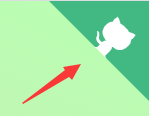
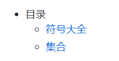

# Docsify工具

## 初识Docsify

### docsify简介

[docsify](https://docsify.js.org/#/zh-cn/?id=docsify) **是一个动态生成文档网站的工具**。不同于 GitBook、Hexo 的地方是它不会生成将 `.md` 转成 `.html` 文件，所有转换工作都是在运行时进行。

### 特性

- 无需构建，写完文档直接发布
- 容易使用并且轻量 (~19kB gzipped)
- 智能的全文搜索
- 提供多套主题
- 丰富的 API
- 支持 Emoji
- 兼容 IE10+
- 支持 SSR ([example](https://github.com/docsifyjs/docsify-ssr-demo))

## 准备工作

### 下载安装Node.js

**[Node.js](https://nodejs.org/zh-cn/)一个基于 Chrome V8 引擎的 JavaScript 运行环境**


**安装好Node.js后，配置环境变量：**

1. 修改用户变量PATH：后面添加`node安装路径\node`。
2. 新增系统变量NODE_PATH：变量值为`node安装路径\node\node_modules`。

打开命令行，输入下面命令，**出现版本号，则说明安装成功**。


### 安装docsify-cli

 `docsify-cli` 工具可以**方便创建及本地预览文档网站**。

```
npm i docsify-cli -g
```

### 初始化项目

在项目的 `./docs` 目录里写文档，直接通过 `init` 初始化项目。

```
docsify init ./docs
```

初始化后，会在当前路径下生成名称为 `docs` 的文件夹，里面有3个文件。

```
- docs 文件夹
	- .nojekyll 用于阻止 GitHub Pages 会忽略掉下划线开头的文件
	- index.html 入口文件
	- README.md 主页内容渲染(直接编辑README.md就能更新网站主页的内容)
```

**手动初始化**：觉得安装工具太麻烦，可以手动初始化，新建一个 `docs` 文件夹，进入文件夹完成下面操作。

1. 新建一个名称为 `.nojekyll` 的空文件。
2. 新建一个名称为 `index` 的 HTML 文件，添加下面内容：


```html
<!DOCTYPE html>
<html lang="en">
<head>
  <meta charset="UTF-8">
  <title>Document</title>
  <meta http-equiv="X-UA-Compatible" content="IE=edge,chrome=1" />
  <meta name="description" content="Description">
  <meta name="viewport" content="width=device-width, user-scalable=no, initial-scale=1.0, maximum-scale=1.0, minimum-scale=1.0">
  <link rel="stylesheet" href="//unpkg.com/docsify/lib/themes/vue.css">
</head>
<body>
  <div id="app"></div>
  <script>
    window.$docsify = {
      name: '',
    }
  </script>
  <script src="//unpkg.com/docsify/lib/docsify.min.js"></script>
</body>
</html>

```

3. 新建一个名称为 `README` 的 md 文件。

### 本地预览

运行一个本地服务器通过 `docsify serve` 可以方便的预览效果，而且提供 LiveReload 功能，可以让实时的预览。默认访问 [http://localhost:3000](http://localhost:3000/) 。

```
docsify serve 项目文件夹名称
```


?> cmd也可以执行该命名，注意执行命令的位置在项目文件夹的同级位置。

## 基础展示

### 网页名称

```html
<title>网页标签名称</title>
```


### 封面

通过修改 `index.html` 文件，设置 `coverpage` 为 `true` 来激活封面功能。

```html
<script>
  window.$docsify = {
    coverpage: true
  }
</script>
<script src="//cdn.jsdelivr.net/npm/docsify/lib/docsify.min.js"></script>
```

**设置好以后，`index.html` 文件会搜索名称为 `_coverpage.md` 文件来作为封面**。我们新建一个`_coverpage.md` 文件添加部分内容：

```


# 个人主页

> 努力，奋斗！

- 上进，上进，还是TMD的上进！

[学习](...)
[积极](...)
[健身](...)
```


默认情况下，背景颜色是随机生成的。您可以自定义背景色或背景图片：

```
<!-- background image -->


<!-- background color -->


```

!> **注意：一个文档站点只能有一个封面，即一个仓库一个封面！**

### Corner 挂件

通过修改 `index.html` 文件配置 `repo` 的字符串，会在页面右上角渲染一个 GitHub Corner 挂件。

```html
window.$docsify = {
  repo: 'https://...'
};
```



### Loading 提示

页面加载时默认会显示 `Loading...` 内容，当然你可以自定义提示信息。

修改`index.html`文件下面内容，这样提示信息就由 `Loading...` 变为 `加载中`。

```html
<div id="app">加载中</div>
```


### 强调内容

docsify 扩展了一些 Markdown 语法，可以让文档更易读。

普通提示：普通的提示信息，语法为 `?> 提示内容`。

```
?> _TODO_ 完善示例
```

?> *_TODO_* 完善示例

重要提示：适合显示重要的提示信息，语法为 `!> 提示内容`。

```
!> 一段重要的内容，可以和其他 **Markdown** 语法混用。
```

!> 一段重要的内容，可以和其他 **Markdown** 语法混用。

### 图片缩放

在图片路径后面`'空格:size=宽度x高度'`，即可调整图片展示大小：

```

    即size=100x100
```


## 添加功能

### 边侧栏

首先在 `index.html` 文件中配置 `loadSidebar` 选项：

```html
<script>
  window.$docsify = {
    loadSidebar: true
  }
</script>
<script src="//unpkg.com/docsify"></script>
```

**配好以后，会自动搜索当前路径下名称为 `_sidebar.md` 的文件，作为边侧栏。**`_sidebar.md` 的加载逻辑是从每层目录下获取文件，如果当前目录不存在该文件则回退到上一级目录。例如当前路径为 `/zh-cn/more-pages` 则从 `/zh-cn/_sidebar.md` 获取文件，如果不存在则从 `/_sidebar.md` 获取。

当然你也可以配置 `alias` 避免不必要的回退过程。

```html
<script>
  window.$docsify = {
    loadSidebar: true,
    alias: {
      '/.*/_sidebar.md': '/_sidebar.md'
    }
  }
</script>
```

我们在根目录新建一个名称为 `_sidebar.md` 的文件。


在里面 `_sidebar.md` 文件里面添加**文本文件的超链接的相对地址**。

```
- 目录
  - [符号大全](/1.符号大全.md)
  - [集合](/2.集合.md)
```



边侧栏标题，会显示在侧边栏顶部。

```html
  <script>
    window.$docsify = {
      <!-- 边侧栏顶部标题--> 
      name: 'Math',
    }
  </script>
```


### 内容标题

文件名称我们已经能在边侧栏中展示了，**展示文件的里面的标题**就需要设置 `subMaxLevel` 配置项了。

```html
<script>
  window.$docsify = {
    loadSidebar: true,
    subMaxLevel: 2
  }
</script>
<script src="//unpkg.com/docsify"></script>
```

`subMaxLevel: 2`**代表只显示2级及以上的标题**。


### 导航栏

导航栏的配置与边侧栏类似，在 `index.html` 文件中配置 `loadNavbar` 选项：

```html
<script>
  window.$docsify = {
    loadNavbar: true
  }
</script>
```

**配好以后，会自动搜索当前路径下名称为 `_navbar.md` 的文件，作为导航栏。**

我们在根目录新建一个名称为 `_navbar.md` 的文件**添加标题和网址**。

```
* [Python](https://baike.baidu.com/item/Python/407313?fr=aladdin)
* [Go](https://baike.baidu.com/item/go/953521)
```


导航栏中还可以创建子导航：

```
* [Python](https://baike.baidu.com/item/Python/407313?fr=aladdin)
    * [python1](...)
    * [python2](...)
    * [python3](...)
* [Go](https://baike.baidu.com/item/go/953521)
```


### 夜晚模式

在`index.html`中添加`darkMode`，可调节背景颜色。

```
window.$docsify = {
    darkMode: {
      light: {
        toggleBtnBg: '#42b983'
      }
    }
}
```


## 插件列表

### 全文搜索

全文搜索插件会**根据当前页面上的超链接获取文档内容**，在 `localStorage` 内建立文档索引。默认过期时间为一天，当然我们可以自己指定需要缓存的文件列表或者配置过期时间。

```html
<script>
  window.$docsify = {
    search: {
      maxAge: 86400000, // 过期时间，单位毫秒，默认一天
      paths: 'auto', // 路径
      placeholder: '搜索', //搜索框默认显示的内容
      noData: '没有结果！', //没有查询结果的显示内容
      // 搜索标题的最大层级, 1 - 6
      depth: 6
    }
  }
</script>
<script src="//unpkg.com/docsify"></script>
<script src="//unpkg.com/docsify/lib/plugins/search.js"></script>
```

### 表情符号

默认为支持解析表情符号，例如`:100:`将解析为:100:，则需要安装此插件。

```html
<script src="//cdn.jsdelivr.net/npm/docsify/lib/plugins/emoji.min.js"></script>
```

### 基金标签

通过基金标签ID，在边侧栏上还可以添加基金标签，每次打开页面，标签会自动变化（目前失效，但官网有更新）。

```html
  <!--基金标签-->
  <script src="//cdn.jsdelivr.net/npm/docsify-plugin-codefund/index.js"></script>
</head>
<body>
...
window.$docsify = {
  plugins: [
    DocsifyCodefund.create('fae1f9a4-870c-4c25-b8e0-c80464f7a95c') 
  ]
}
```


### 代码高亮

内置的代码高亮工具是 [Prism](https://github.com/PrismJS/prism)，默认支持 CSS、JavaScript 和 HTML。如果需要高亮其语言——例如 PHP——可以手动引入代码高亮插件。

```html
<script src="//unpkg.com/docsify"></script>
<script src="//unpkg.com/prismjs/components/prism-bash.js"></script>
<script src="//unpkg.com/prismjs/components/prism-php.js"></script>
```

### 公式渲染

KaTeX 数学公式渲染库：

```html
<link rel="stylesheet" href="//cdn.jsdelivr.net/npm/katex@latest/dist/katex.min.css"/>
<script src="//cdn.jsdelivr.net/npm/docsify-katex@latest/dist/docsify-katex.js"></script>
```

### 主题

官方提供了4套主题，可任意选择：

```html
<!--绿色主题，白色背景，黑色字体，绿色挂件(默认)-->
<link rel="stylesheet" href="//cdn.jsdelivr.net/npm/docsify/lib/themes/vue.css">
<!--蓝色主题，白色背景，黑色字体，蓝色挂件-->
<link rel="stylesheet" href="//cdn.jsdelivr.net/npm/docsify/lib/themes/buble.css">
<!--黑暗主题，黑色背景，白色字体，红色挂件-->
<link rel="stylesheet" href="//cdn.jsdelivr.net/npm/docsify/lib/themes/dark.css">
<!--纯净主题，白色背景，黑色字体，黑色挂件-->
<link rel="stylesheet" href="//cdn.jsdelivr.net/npm/docsify/lib/themes/pure.css">
```

## 代码部署

代码部署也很简单，只要 GitHub 的仓库开启了 GutHub Page ，把自定义好的`index.html`、`_coverpage.md` 等文件上传到 GitHub 的仓库中，即可在 GutHub Page 中展示内容。

### 我的封面

封面加载的`index.html`文件：

```html
<!DOCTYPE html>
<html lang="en">
<head>
  <meta charset="UTF-8">
  <!--网页名称-->
  <title>Chen-Zhuo</title>
  <!--网页前面的小图标-->
  <link rel="icon" href="https://chen-zhuo.github.io/image/avatar.jpg">
  <meta http-equiv="X-UA-Compatible" content="IE=edge,chrome=1" />
  <meta name="description" content="Description">
  <meta name="viewport" content="width=device-width, user-scalable=no, initial-scale=1.0, maximum-scale=1.0, minimum-scale=1.0">
  <link rel="stylesheet" href="vue.css">
</head>
<body>
  <!--等待加载的显示内容-->
  <div id="app">加载中...</div>
<script>
  window.$docsify = {
    coverpage: true
  }
</script>
  <!--基础框架-->
  <script src="//unpkg.com/docsify/lib/docsify.min.js"></script>
  <!--封面-->
  <script src="//cdn.jsdelivr.net/npm/docsify/lib/docsify.min.js"></script>
</body>
</html>
```

封面的主要内容是加载 `_coverpage.md` 文件，我的封面文件：

```markdown


<font size="10">Chen-Zhuo</font>

> 但行好事，莫问前程！

- <font size="4">Document知识库：Markdown语法、LaTeX排版、GitHub平台、Git版本控制、Docsify工具</font>

- <font size="4">Python知识库：Python语言基础、Spider网络爬虫、Web后端开发</font>

- <font size="4">JavaScript知识库：JavaScript语言基础、JavaScript逆向调试</font>

- <font size="4">DataBase知识库：MySQL数据库、MongoDB数据库、Redis数据库</font>

- <font size="4">System知识库：DOS批处理、Linux系统、Windows系统</font>

[Document](https://chen-zhuo.github.io/Document/) [Python](https://chen-zhuo.github.io/Python/) [JavaScript](https://chen-zhuo.github.io/JavaScript/) [DataBase](https://chen-zhuo.github.io/DataBase/) [System](https://chen-zhuo.github.io/System/) [GitHub](https://github.com/chen-zhuo)
```

在上面 `index.html` 我们引用了自定义CSS文件，内容如下：

```css
@import url("https://fonts.googleapis.com/css?family=Roboto+Mono|Source+Sans+Pro:300,400,600");* {
    -webkit-font-smoothing: antialiased;
    -webkit-overflow-scrolling: touch;
    -webkit-tap-highlight-color: rgba(0,0,0,0);
    -webkit-text-size-adjust: none;
    -webkit-touch-callout: none;
    box-sizing: border-box
}

body:not(.ready) {
    overflow: hidden
}

body:not(.ready) .app-nav,body:not(.ready)>nav,body:not(.ready) [data-cloak] {
    display: none
}

div#app {
    font-size: 30px;
    font-weight: lighter;
    margin: 40vh auto;
    text-align: center
}

div#app:empty:before {
    content: "Loading..."
}

.emoji {
    height: 1.2rem;
    vertical-align: middle
}

.progress {
    background-color: var(--theme-color,#42b983);
    height: 2px;
    left: 0;
    position: fixed;
    right: 0;
    top: 0;
    transition: width .2s,opacity .4s;
    width: 0;
    z-index: 999999
}

.search .search-keyword,.search a:hover {
    color: var(--theme-color,#42b983)
}

.search .search-keyword {
    font-style: normal;
    font-weight: 700
}

body,html {
    height: 100%
}

body {
    -moz-osx-font-smoothing: grayscale;
    -webkit-font-smoothing: antialiased;
    color: #34495e;
    font-family: Source Sans Pro,Helvetica Neue,Arial,sans-serif;
    font-size: 15px;
    letter-spacing: 0;
    margin: 0;
    overflow-x: hidden
}

img {
    max-width: 100%
}

a[disabled] {
    cursor: not-allowed;
    opacity: .6
}

kbd {
    border: 1px solid #ccc;
    border-radius: 3px;
    display: inline-block;
    font-size: 12px!important;
    line-height: 12px;
    margin-bottom: 3px;
    padding: 3px 5px;
    vertical-align: middle
}

li input[type=checkbox] {
    margin: 0 .2em .25em 0;
    vertical-align: middle
}

.app-nav {
    margin: 25px 60px 0 0;
    position: absolute;
    right: 0;
    text-align: right;
    z-index: 10
}

.app-nav.no-badge {
    margin-right: 25px
}

.app-nav p {
    margin: 0
}

.app-nav>a {
    margin: 0 1rem;
    padding: 5px 0
}

.app-nav li,.app-nav ul {
    display: inline-block;
    list-style: none;
    margin: 0
}

.app-nav a {
    color: inherit;
    font-size: 16px;
    text-decoration: none;
    transition: color .3s
}

.app-nav a.active,.app-nav a:hover {
    color: var(--theme-color,#42b983)
}

.app-nav a.active {
    border-bottom: 2px solid var(--theme-color,#42b983)
}

.app-nav li {
    display: inline-block;
    margin: 0 1rem;
    padding: 5px 0;
    position: relative;
    cursor: pointer
}

.app-nav li ul {
    background-color: #fff;
    border: 1px solid;
    border-color: #ddd #ddd #ccc;
    border-radius: 4px;
    box-sizing: border-box;
    display: none;
    max-height: calc(100vh - 61px);
    overflow-y: auto;
    padding: 10px 0;
    position: absolute;
    right: -15px;
    text-align: left;
    top: 100%;
    white-space: nowrap
}

.app-nav li ul li {
    display: block;
    font-size: 14px;
    line-height: 1rem;
    margin: 8px 14px;
    white-space: nowrap
}

.app-nav li ul a {
    display: block;
    font-size: inherit;
    margin: 0;
    padding: 0
}

.app-nav li ul a.active {
    border-bottom: 0
}

.app-nav li:hover ul {
    display: block
}

.github-corner {
    border-bottom: 0;
    position: fixed;
    right: 0;
    text-decoration: none;
    top: 0;
    z-index: 1
}

.github-corner:hover .octo-arm {
    -webkit-animation: octocat-wave .56s ease-in-out;
    animation: octocat-wave .56s ease-in-out
}

.github-corner svg {
    color: #fff;
    fill: var(--theme-color,#42b983);
    height: 80px;
    width: 80px
}

main {
    display: block;
    position: relative;
    width: 100vw;
    height: 100%;
    z-index: 0
}

main.hidden {
    display: none
}

.anchor {
    display: inline-block;
    text-decoration: none;
    transition: all .3s
}

.anchor span {
    color: #34495e
}

.anchor:hover {
    text-decoration: underline
}

.sidebar {
    border-right: 1px solid rgba(0,0,0,.07);
    overflow-y: auto;
    padding: 40px 0 0;
    position: absolute;
    top: 0;
    bottom: 0;
    left: 0;
    transition: transform .25s ease-out;
    width: 300px;
    z-index: 20
}

.sidebar>h1 {
    margin: 0 auto 1rem;
    font-size: 1.5rem;
    font-weight: 300;
    text-align: center
}

.sidebar>h1 a {
    color: inherit;
    text-decoration: none
}

.sidebar>h1 .app-nav {
    display: block;
    position: static
}

.sidebar .sidebar-nav {
    line-height: 2em;
    padding-bottom: 40px
}

.sidebar li.collapse .app-sub-sidebar {
    display: none
}

.sidebar ul {
    margin: 0 0 0 15px;
    padding: 0
}

.sidebar li>p {
    font-weight: 700;
    margin: 0
}

.sidebar ul,.sidebar ul li {
    list-style: none
}

.sidebar ul li a {
    border-bottom: none;
    display: block
}

.sidebar ul li ul {
    padding-left: 20px
}

.sidebar::-webkit-scrollbar {
    width: 4px
}

.sidebar::-webkit-scrollbar-thumb {
    background: transparent;
    border-radius: 4px
}

.sidebar:hover::-webkit-scrollbar-thumb {
    background: hsla(0,0%,53.3%,.4)
}

.sidebar:hover::-webkit-scrollbar-track {
    background: hsla(0,0%,53.3%,.1)
}

.sidebar-toggle {
    background-color: transparent;
    background-color: hsla(0,0%,100%,.8);
    border: 0;
    outline: none;
    padding: 10px;
    position: absolute;
    bottom: 0;
    left: 0;
    text-align: center;
    transition: opacity .3s;
    width: 284px;
    z-index: 30;
    cursor: pointer
}

.sidebar-toggle:hover .sidebar-toggle-button {
    opacity: .4
}

.sidebar-toggle span {
    background-color: var(--theme-color,#42b983);
    display: block;
    margin-bottom: 4px;
    width: 16px;
    height: 2px
}

body.sticky .sidebar,body.sticky .sidebar-toggle {
    position: fixed
}

.content {
    padding-top: 60px;
    position: absolute;
    top: 0;
    right: 0;
    bottom: 0;
    left: 300px;
    transition: left .25s ease
}

.markdown-section {
    margin: 0 auto;
    max-width: 80%;
    padding: 30px 15px 40px;
    position: relative
}

.markdown-section>* {
    box-sizing: border-box;
    font-size: inherit
}

.markdown-section>:first-child {
    margin-top: 0!important
}

.markdown-section hr {
    border: none;
    border-bottom: 1px solid #eee;
    margin: 2em 0
}

.markdown-section iframe {
    border: 1px solid #eee;
    width: 1px;
    min-width: 100%
}

.markdown-section table {
    border-collapse: collapse;
    border-spacing: 0;
    display: block;
    margin-bottom: 1rem;
    overflow: auto;
    width: 100%
}

.markdown-section th {
    font-weight: 700
}

.markdown-section td,.markdown-section th {
    border: 1px solid #ddd;
    padding: 6px 13px
}

.markdown-section tr {
    border-top: 1px solid #ccc
}

.markdown-section p.tip,.markdown-section tr:nth-child(2n) {
    background-color: #f8f8f8
}

.markdown-section p.tip {
    border-bottom-right-radius: 2px;
    border-left: 4px solid #f66;
    border-top-right-radius: 2px;
    margin: 2em 0;
    padding: 12px 24px 12px 30px;
    position: relative
}

.markdown-section p.tip:before {
    background-color: #f66;
    border-radius: 100%;
    color: #fff;
    content: "!";
    font-family: Dosis,Source Sans Pro,Helvetica Neue,Arial,sans-serif;
    font-size: 14px;
    font-weight: 700;
    left: -12px;
    line-height: 20px;
    position: absolute;
    height: 20px;
    width: 20px;
    text-align: center;
    top: 14px
}

.markdown-section p.tip code {
    background-color: #efefef
}

.markdown-section p.tip em {
    color: #34495e
}

.markdown-section p.warn {
    background: rgba(66,185,131,.1);
    border-radius: 2px;
    padding: 1rem
}

.markdown-section ul.task-list>li {
    list-style-type: none
}

body.close .sidebar {
    transform: translateX(-300px)
}

body.close .sidebar-toggle {
    width: auto
}

body.close .content {
    left: 0
}

@media print {
    .app-nav,.github-corner,.sidebar,.sidebar-toggle {
        display: none
    }
}

@media screen and (max-width: 768px) {
    .github-corner,.sidebar,.sidebar-toggle {
        position:fixed
    }

    .app-nav {
        margin-top: 16px
    }

    .app-nav li ul {
        top: 30px
    }

    main {
        height: auto;
        overflow-x: hidden
    }

    .sidebar {
        left: -300px;
        transition: transform .25s ease-out
    }

    .content {
        left: 0;
        max-width: 100vw;
        position: static;
        padding-top: 20px;
        transition: transform .25s ease
    }

    .app-nav,.github-corner {
        transition: transform .25s ease-out
    }

    .sidebar-toggle {
        background-color: transparent;
        width: auto;
        padding: 30px 30px 10px 10px
    }

    body.close .sidebar {
        transform: translateX(300px)
    }

    body.close .sidebar-toggle {
        background-color: hsla(0,0%,100%,.8);
        transition: background-color 1s;
        width: 284px;
        padding: 10px
    }

    body.close .content {
        transform: translateX(300px)
    }

    body.close .app-nav,body.close .github-corner {
        display: none
    }

    .github-corner:hover .octo-arm {
        -webkit-animation: none;
        animation: none
    }

    .github-corner .octo-arm {
        -webkit-animation: octocat-wave .56s ease-in-out;
        animation: octocat-wave .56s ease-in-out
    }
}

@-webkit-keyframes octocat-wave {
    0%,to {
        transform: rotate(0)
    }

    20%,60% {
        transform: rotate(-25deg)
    }

    40%,80% {
        transform: rotate(10deg)
    }
}

@keyframes octocat-wave {
    0%,to {
        transform: rotate(0)
    }

    20%,60% {
        transform: rotate(-25deg)
    }

    40%,80% {
        transform: rotate(10deg)
    }
}

section.cover {
    align-items: center;
    background-position: 50%;
    background-repeat: no-repeat;
    background-size: cover;
    height: 100vh;
    width: 100vw;
    display: none
}

section.cover.show {
    display: flex
}

section.cover.has-mask .mask {
    background-color: #fff;
    opacity: .8;
    position: absolute;
    top: 0;
    height: 100%;
    width: 100%
}

section.cover .cover-main {
    flex: 1;
    margin: -20px 16px 0;
    text-align: center;
    position: relative
}

section.cover a {
    color: inherit
}

section.cover a,section.cover a:hover {
    text-decoration: none
}

section.cover p {
    line-height: 1.5rem;
    margin: 1em 0
}

section.cover h1 {
    color: inherit;
    font-size: 2.5rem;
    font-weight: 300;
    margin: .625rem 0 2.5rem;
    position: relative;
    text-align: center
}

section.cover h1 a {
    display: block
}

section.cover h1 small {
    bottom: -.4375rem;
    font-size: 1rem;
    position: absolute
}

section.cover blockquote {
    font-size: 1.5rem;
    text-align: center
}

section.cover ul {
    line-height: 1.8;
    list-style-type: none;
    margin: 1em auto;
    max-width: 1000px;
    padding: 0
}

section.cover .cover-main>p:last-child a {
    border-radius: 2rem;
    border: 1px solid var(--theme-color,#42b983);
    box-sizing: border-box;
    color: var(--theme-color,#42b983);
    display: inline-block;
    font-size: 1.05rem;
    letter-spacing: .1rem;
    margin: .5rem 1rem;
    padding: .75em 2rem;
    text-decoration: none;
    transition: all .15s ease
}

section.cover .cover-main>p:last-child a:last-child {
    background-color: var(--theme-color,#42b983);
    color: #fff
}

section.cover .cover-main>p:last-child a:last-child:hover {
    color: inherit;
    opacity: .8
}

section.cover .cover-main>p:last-child a:hover {
    color: inherit
}

section.cover blockquote>p>a {
    border-bottom: 2px solid var(--theme-color,#42b983);
    transition: color .3s
}

section.cover blockquote>p>a:hover {
    color: var(--theme-color,#42b983)
}

.sidebar,body {
    background-color: #fff
}

.sidebar {
    color: #364149
}

.sidebar li {
    margin: 6px 0
}

.sidebar ul li a {
    color: #505d6b;
    font-size: 14px;
    font-weight: 400;
    overflow: hidden;
    text-decoration: none;
    text-overflow: ellipsis;
    white-space: nowrap
}

.sidebar ul li a:hover {
    text-decoration: underline
}

.sidebar ul li ul {
    padding: 0
}

.sidebar ul li.active>a {
    border-right: 2px solid;
    color: var(--theme-color,#42b983);
    font-weight: 600
}

.app-sub-sidebar li:before {
    content: "-";
    padding-right: 4px;
    float: left
}

.markdown-section h1,.markdown-section h2,.markdown-section h3,.markdown-section h4,.markdown-section strong {
    color: #2c3e50;
    font-weight: 600
}

.markdown-section a {
    color: var(--theme-color,#42b983);
    font-weight: 600
}

.markdown-section h1 {
    font-size: 2rem;
    margin: 0 0 1rem
}

.markdown-section h2 {
    font-size: 1.75rem;
    margin: 45px 0 .8rem
}

.markdown-section h3 {
    font-size: 1.5rem;
    margin: 40px 0 .6rem
}

.markdown-section h4 {
    font-size: 1.25rem
}

.markdown-section h5 {
    font-size: 1rem
}

.markdown-section h6 {
    color: #777;
    font-size: 1rem
}

.markdown-section figure,.markdown-section p {
    margin: 1.2em 0
}

.markdown-section ol,.markdown-section p,.markdown-section ul {
    line-height: 1.6rem;
    word-spacing: .05rem
}

.markdown-section ol,.markdown-section ul {
    padding-left: 1.5rem
}

.markdown-section blockquote {
    border-left: 4px solid var(--theme-color,#42b983);
    color: #858585;
    margin: 2em 0;
    padding-left: 20px
}

.markdown-section blockquote p {
    font-weight: 600;
    margin-left: 0
}

.markdown-section iframe {
    margin: 1em 0
}

.markdown-section em {
    color: #7f8c8d
}

.markdown-section code,.markdown-section output:after,.markdown-section pre {
    font-family: Roboto Mono,Monaco,courier,monospace
}

.markdown-section code,.markdown-section pre {
    background-color: #f8f8f8
}

.markdown-section output,.markdown-section pre {
    margin: 1.2em 0;
    position: relative
}

.markdown-section output,.markdown-section pre>code {
    border-radius: 2px;
    display: block
}

.markdown-section output:after,.markdown-section pre>code {
    -moz-osx-font-smoothing: initial;
    -webkit-font-smoothing: initial
}

.markdown-section code {
    border-radius: 2px;
    color: #e96900;
    margin: 0 2px;
    padding: 3px 5px;
    white-space: pre-wrap
}

.markdown-section>:not(h1):not(h2):not(h3):not(h4):not(h5):not(h6) code {
    font-size: .8rem
}

.markdown-section pre {
    padding: 0 1.4rem;
    line-height: 1.5rem;
    overflow: auto;
    word-wrap: normal
}

.markdown-section pre>code {
    color: #525252;
    font-size: .8rem;
    padding: 2.2em 5px;
    line-height: inherit;
    margin: 0 2px;
    max-width: inherit;
    overflow: inherit;
    white-space: inherit
}

.markdown-section output {
    padding: 1.7rem 1.4rem;
    border: 1px dotted #ccc
}

.markdown-section output>:first-child {
    margin-top: 0
}

.markdown-section output>:last-child {
    margin-bottom: 0
}

.markdown-section code:after,.markdown-section code:before,.markdown-section output:after,.markdown-section output:before {
    letter-spacing: .05rem
}

.markdown-section output:after,.markdown-section pre:after {
    color: #ccc;
    font-size: .6rem;
    font-weight: 600;
    height: 15px;
    line-height: 15px;
    padding: 5px 10px 0;
    position: absolute;
    right: 0;
    text-align: right;
    top: 0;
    content: attr(data-lang)
}

.token.cdata,.token.comment,.token.doctype,.token.prolog {
    color: #8e908c
}

.token.namespace {
    opacity: .7
}

.token.boolean,.token.number {
    color: #c76b29
}

.token.punctuation {
    color: #525252
}

.token.property {
    color: #c08b30
}

.token.tag {
    color: #2973b7
}

.token.string {
    color: var(--theme-color,#42b983)
}

.token.selector {
    color: #6679cc
}

.token.attr-name {
    color: #2973b7
}

.language-css .token.string,.style .token.string,.token.entity,.token.url {
    color: #22a2c9
}

.token.attr-value,.token.control,.token.directive,.token.unit {
    color: var(--theme-color,#42b983)
}

.token.function,.token.keyword {
    color: #e96900
}

.token.atrule,.token.regex,.token.statement {
    color: #22a2c9
}

.token.placeholder,.token.variable {
    color: #3d8fd1
}

.token.deleted {
    text-decoration: line-through
}

.token.inserted {
    border-bottom: 1px dotted #202746;
    text-decoration: none
}

.token.italic {
    font-style: italic
}

.token.bold,.token.important {
    font-weight: 700
}

.token.important {
    color: #c94922
}

.token.entity {
    cursor: help
}

code .token {
    -moz-osx-font-smoothing: initial;
    -webkit-font-smoothing: initial;
    min-height: 1.5rem;
    position: relative;
    left: auto
}
```

### 我的仓库

结合上面的功能，拼凑出适用展示我的各个仓库的网页代码（**仓库没有设置封面页**）：

```html
  
<!DOCTYPE html>
<html lang="en">
<head>
  <meta charset="UTF-8">
  <!--网页名称-->
  <title>Python</title>
  <!--网页小图标-->
  <link rel="icon" href="https://chen-zhuo.github.io/image/avatar.jpg">
  <meta http-equiv="X-UA-Compatible" content="IE=edge,chrome=1" />
  <meta name="description" content="Description">
  <meta name="viewport" content="width=device-width, user-scalable=no, initial-scale=1.0, maximum-scale=1.0, minimum-scale=1.0">
  <!--vue主题样式-->
  <link rel="stylesheet" href="//unpkg.com/docsify/lib/themes/vue.css">
  <!--夜晚模式样式-->
  <link rel="stylesheet" href="//cdn.jsdelivr.net/npm/docsify-dark-mode@0.6.1/dist/style.css"/>
  <!--数学符号样式-->
  <link rel="stylesheet" href="//cdn.jsdelivr.net/npm/katex@latest/dist/katex.min.css"/>
</head>
<body>
  <!--等待加载的显示内容-->
  <div id="app">加载中...</div>
  <script>
    window.$docsify = {
      <!--边侧栏标题-->
      name: 'Python',
      <!--加载导航栏-->
      loadNavbar: true,
      <!--加载边侧栏-->
      loadSidebar:true,
      <!--内容标题等级-->
      subMaxLevel: 5,
      <!--Corner 挂件-->
      repo: 'https://github.com/chen-zhuo',
      <!--夜晚模式-->
      darkMode: {
        light: {
          toggleBtnBg: '#42b983'
        }
      },
      <!--定义搜索框-->
      search: {
      placeholder: '搜索', //搜索框默认显示的内容
      noData: '没有结果！', //没有查询结果的显示内容
      }
    }
  </script>
  <!--基础框架-->
  <script src="//unpkg.com/docsify/lib/docsify.min.js"></script>
  <!--夜晚模式插件-->
  <script src="https://cdn.jsdelivr.net/npm/docsify-dark-mode@0.6.1/dist/index.js"></script>
  <!--搜索框插件-->
  <script src="//unpkg.com/docsify/lib/plugins/search.js"></script>
  <!--表情符解析-->
  <script src="//cdn.jsdelivr.net/npm/docsify/lib/plugins/emoji.min.js"></script>
  <!--python代码高亮-->
  <script src="//unpkg.com/prismjs/components/prism-python.js"></script>
  <!--go代码高亮-->
  <script src="//unpkg.com/prismjs/components/prism-go.js"></script>
  <!--c代码高亮-->
  <script src="//unpkg.com/prismjs/components/prism-c.js"></script>
  <!--java代码高亮-->
  <script src="//unpkg.com/prismjs/components/prism-java.js"></script>
  <!--javascript代码高亮-->
  <script src="//unpkg.com/prismjs/components/prism-javascript.js"></script>
  <!--sql语句高亮-->
  <script src="//unpkg.com/prismjs/components/prism-sql.js"></script>
  <!--katex数学公式渲染库-->
  <script src="//cdn.jsdelivr.net/npm/docsify-katex@latest/dist/docsify-katex.js"></script>
</body>
</html>
```

### 我的踩坑

坑1：文档中转义符 \ 和 `在一起使用，会导致 KaTeX 不能正确渲染数学公式。

坑2：文档中加粗符号**和`在一起使用若后面有字符，会导致文档不能正确渲染。


坑3：文档中大标题中的小标题不能越级，否则标题栏不能显示出层次。


