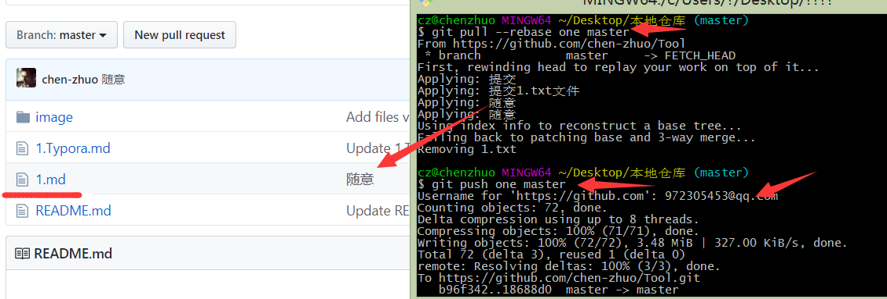
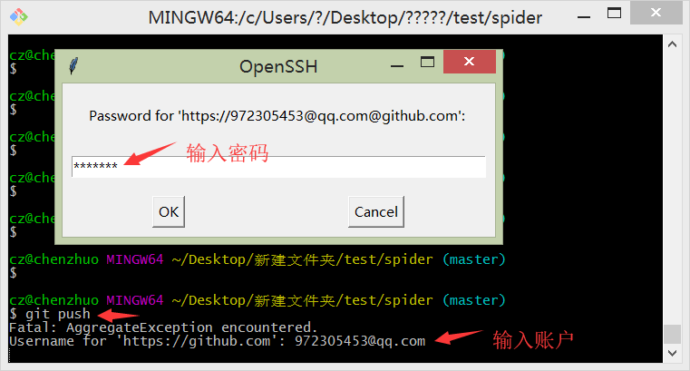
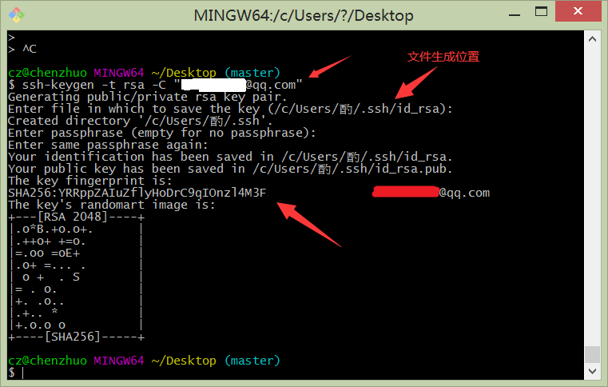
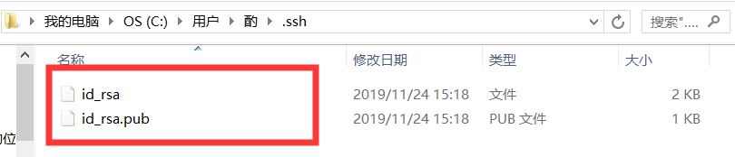
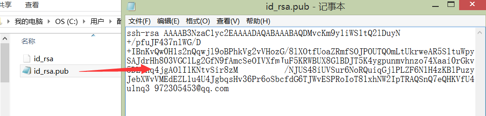
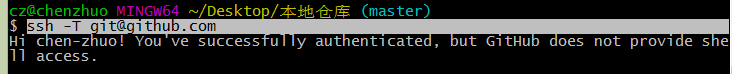
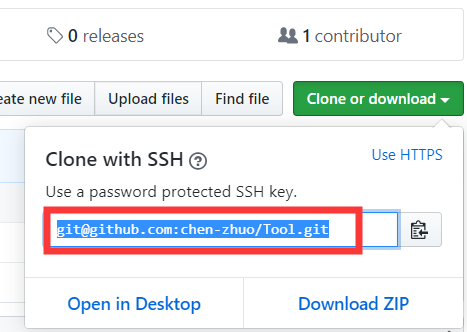

# *Git*

[*Git*](https://git-scm.com/) 是一个开源的分布式版本控制系统。

### *Git* 介绍

使用 *Git* 需要先在电脑上下载安装 *Git*，之后它就会出现在点击鼠标右键的菜单栏里面。


##### *Git* 模式

*Git GUI Here*：图形界面模式

*Git Bash Here*：命令行模式（推荐）

##### *Git* 工作区域

工作区：添加、编辑、修改文件等动作

暂存区：暂存已经修改的文件最后统一提交带 *Git* 仓库中

历史区：最终确定的文件保存到仓库，称为一个新的版本，并且对他人可见

##### *Git* 工作流程

工作区——>暂存区——>历史区——>GitHub 仓库（网络仓库）

##### *Git* 命令

*Git* 当中许多命令和 *Linux* 一样。

```
ls：查看当前文件夹内的文件

pwd：查看当前所在路径

mkdir XXX：当前目录下创建一个XXX文件夹

touch a.XXX：当前目录下生成一个a.XXX文件

vim a.XXX：编辑文件a.XXX
	1.vim是一个编辑器
	2.按i键进入编辑模式
	3.按esc键进入阅读模式
	4.阅读模式下，输入:wq保存编辑并退出，输入:q!不保存编辑并退出

cat a.XXX：查看文件a.XXX的内容

git status：查看状态
	1.红色文件名：表示文件在工作区
	2.绿色文件名：表示文件在暂存区
	3.无文件名：表示所有提交的东西都在历史区

git add test.txt：将test.txt文件从工作区提交到暂存区

git rm 文件名： 同时从工作区和索引中删除文件。即本地的文件也被删除了。

git rm --cached 文件名： 从索引中删除文件。但是本地文件还存在， 只是不希望这个文件被版本控制。

git commit -m "提交描述"：将暂存区的文件提交到Git仓库，并添加提交描述
```

### 仓库管理

##### 配置用户

查看配置

```
# 配置信息
git config -l
# 全局配置信息
git config --global -l
```

设置用户

```
git config --global user.name'chen-zhuo'：设置用户名chen-zhuo

git config --global user.email'972305453@qq.com'：设置用户邮箱
```

##### 新建 *Git* 仓库

新建一个test文件夹

```
mkdir test
```

进入文件夹内初始化为Git仓库

```
cd test
git init

# 注释：执行后，会在该文件夹内生成一个.git文件夹，它是用来存储本地仓库数据信息的
```

##### 添加仓库文件

在仓库内部添加新文件

```
# 方法一：用vim来新建文件
cd spider 
vim 1.txt	# 1.txt不存在时，vim会自动新建；1.txt存在，就编辑文件。按i键，添加内容'first'，按esc键，输入:wq，保存退出

# 方法二：手动来新建文件并添加内容
```


查看文件状态

```
git status
```

文件名为红色，表明该文件在工作区


##### 提交仓库文件

将新建文件添加到暂存区

```
# 将当前仓库中最新修改的文件提交到暂存区
git add .
git add -A

# 只将一个文件1.txt提交到暂存区
git add 1.txt
```

提交文件后，查看文件状态，文件名为绿色，表明该文件在暂存区


将暂存区文件提交到历史区

```
# 将暂存的所有文件提交到历史区
git commit -m '提交内容的描述'

# 查看历史版本信息
git log
git reflog（包括回滚信息）
```

提交文件后，查看文件状态就没有文件显示了，输入命令可以查看提交描述


##### 连接远程仓库

```
# 查看所有当前连接的远程仓库
git remote -v

# 连接远程仓库
# 连接名称可任意命名，一般为origin，后面加上仓库的地址。
git remote add 连接名称 仓库地址

# 移除远程仓库连接
git remote remove 连接名称

# 修改远程仓库的命名 
git remote rename 连接名称 新连接名称
```


##### 同步仓库文件

```
# master 就是远程分支
# 同步前之前最好先拉取
git pull 连接名称 master
# 如果远程仓库和本地仓库文件差别过大，上面命令可能报错，就可以用这条命令在本地合并两个仓库。
git pull --rebase 连接名称 master

# 上传文件
git push 连接名称 master
```



*push* 命令需要输入 *GitHub* 用户名和密码



##### 克隆仓库文件

复制 *GitHub* 仓库地址


克隆 *GitHub* 仓库到本地

```
git clone 仓库地址
```


##### 身份认证

每一次更新远程库需要进行登录，就显得很繁琐，我们就需要 *SSH Key* 来进行身份认证，不必每次登录。

创建 *SSH Key*

```
# 输入该命令，一路回车，生成公钥和密钥文件
ssh-keygen -t rsa -C "972305453@qq.com"
```



找到文件生成的地方，当中有两个文件个就是 *SSH Key* 的秘钥对，*id_rsa* 是私钥，不能泄露出去，*id_rsa.pub* 是公钥，可 以放心地告诉任何⼈。



用记事本格式打开 *id_rsa.pub* 并复制其中的内容



打开并登录 *GitHub* 网站在 *settings* 中新增 *New SSH key*


将复制的内容粘贴其中，并添加上标题，点击 *Add SSH key*，网站上的账户就成功添加了公钥。


输入命令尝试 *SSH* 连接，就成功连接上了。

```
ssh -T git@github.com
```



这个时候我们上传文件就不使用远程仓库的地址，我们就使用远程仓库的 *SSH*




将远程仓库的 *SSH* 添加到连接列表中


上传文件我们就通过 *SSH* 来传递文件，就不用输入密码了。


### 总结

1. *GitHub* 允许你添加多个 *Key*。假定你有若干电脑，你⼀会儿在公司提交，⼀会儿在家里提交，只要把每台电脑的 *Key* 都添加到 *GitHub*，就可以在每台电脑上往 *GitHub* 推送 了。
2. *Git* 的克隆仓库也可以使用远程仓库的 *SSH* 地址。
3. 更新仓库最好先将仓库克隆到本地再更新，有 *SSH* 到时候更新完成，直接 *git push* 就可好啦。

