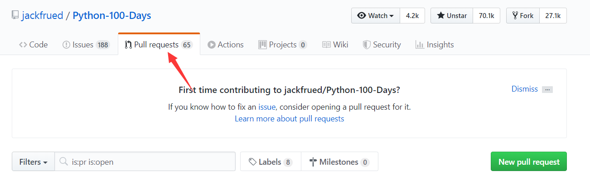
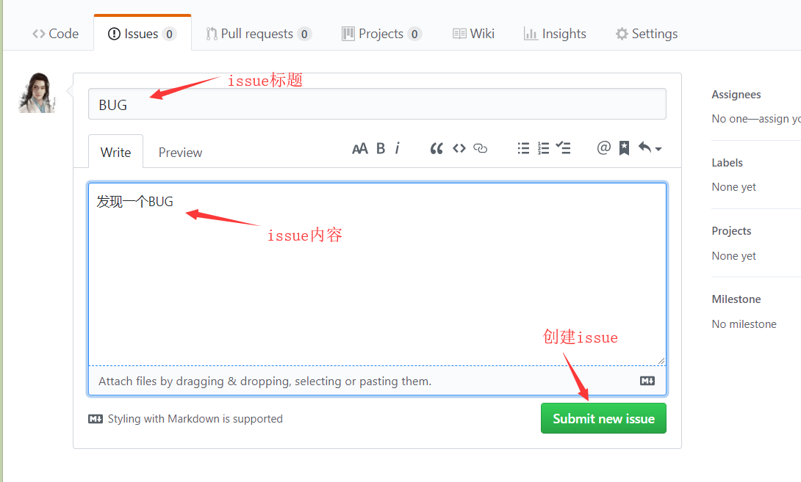
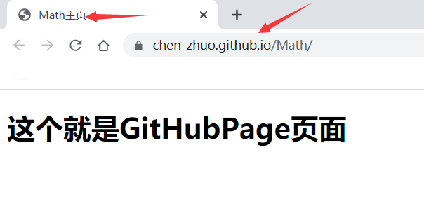
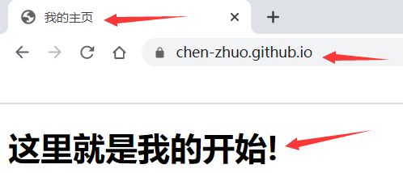

# GitHub 平台

**简单说，[GitHub](https://github.com/) 是微软旗下的一个的项目代码托管平台。**

## 加速访问

由于GitHub的服务器是放在国外的，有时访问较慢或无法访问，必要时可以翻墙以提高访问速度。**其实除了翻墙，还有一种方法就是修改host文件。**

首先，我们要知道一点就是，**浏览器通过网址访问网站过程，是先拿到网址去查询了对应的IP地址，再去访问了该IP地址下面的网络资源。**具体的流程如下：


**可以看到，浏览器访问网站地址时，它会去本机的host文件里去查询域名对应的IP；如果没有，它就会去DNS服务器去查询，将域名解析后就得到相应的IP地址，通过查询到的IP连接上Web服务器。所以我们可以通过修改host文件中域名自定义内容来加速网络访问！**

首先，我们通过 https://github.com.ipaddress.com/ 该网站来获取Github的IP地址：


windows系统的hosts文件的位置如下：`C:\Windows\System32\drivers\etc\hosts`
mac/linux系统的hosts文件的位置如下：`/etc/host`


找到host文件并进行修改，在最下方添加如下内容：

```
140.82.112.4 GitHub.com
```


最后保存并退出即可，再去访问Github网站你就会发现访问速度变快了。

## 功能模块

### Respository

**Respository 意思为仓库，功能就是存放自己上传的项目代码。**

在 GitHub 上开源一个项目，就需要新建一个 Respository，一般一个仓库对应一个项目。


### Start

**Start 意思为收藏，功能就是收藏自己或别人的代码库的网址。**

每当一个人收藏该项目，该项目的 *Start* 的数量就会加1，在 GitHub 一个项目能获得100个 Start 就很不容易了。


### Fork

**Fork 意思为克隆，功能就是将别人的项目代码拷贝一份到自己的仓库。**

Fork（克隆）与 Start （收藏）区别：克隆会在自己的仓库中为该项目新建一个的独立仓库，克隆仓库和源仓库是两个独立的仓库，都是可修改编辑的且互不影响；收藏则不会产生新仓库，就只是保存源仓库的网址而已。

!> Fork 在别人的仓库中才有效，也就是说，克隆只能克隆别人的仓库，不能克隆自己的仓库。


### Pull Request

**Pull Request 意思为更新请求，功能就是将克隆仓库的修改更新到源仓库上。**

举例，李四克隆张三的仓库，生成新仓库，并修改了新仓库的文件，给张三就发起了请求 Pull Request，希望张三更新他所修改的文件。



### Watch

**Watch 意思为关注，功能就是接收被关注项目的修改通知。**

举例：张三关注了李四的某个项目，以后李四只要对这个项目有任何更新，张三都会第一时间收到提醒。


### Issues

**Issues 意思为提问，功能就是给项目作者发起自己关于该项目的提问。**


## 主页

### github主页

点击github图标，就可以进入github主页


### 个人主页

点击头像，点击your profile就可以进入个人主页


### 仓库主页

点击 *Respository* 进入仓库主页，显示当前自己的仓库列表。


点击仓库的名称，即可进入仓库，显示仓库中的文件。


!> 仓库主页页面的中的内容就是仓库中 *README.md* 里面的内容。

## 基本操作

### 仓库增删改查

**新建仓库**

个人主页——点击 *Repositories* ——点击 *New*，创建新仓库


填写下面必要的内容。


?> 新用户要验证邮箱后，才能新建仓库。

?> 私有仓库只能自己或指定朋友才有权限操作，而且是收费的。

创建仓库后，直接进入到所创建仓库页面。


**删除仓库**

进入仓库，点击 *setting* 。


在最下方点击 *Delete this repository* 


输入当前的要删除的仓库名，点击下方确认按钮即可删除该仓库。


**修改仓库**

修改仓库描述：进入仓库点击 *Edit* ，编辑仓库描述，点击 *Save* 即可保存。


修改仓库名：进入仓库点击 *Setting* ，编辑仓库名，点击 *Rename* 即可保存。


**查找仓库**

点击 *Respository* ，输入需要查找的仓库名即可。


### 增删改查文件

**新建文件**

点击上图的Create new file，创建仓库文件


在新建文件页面的下方，填写新建文件的说明


提交新建文件后，直接回到仓库


点击提交文件的标题，可以查看提交的说明


**删除文件**

在仓库主页点击要删除的文件名


进入文件主页


点击删除当前文件


填写说明，点击提交，回到仓库主页


点击 *commits*（提交次数）


点击最新的提交


**编辑文件**

在仓库主页点击需要编辑文件的文件名


进入文件主页


点击进入编辑模式


和上面新建文件类似，在下方也要填写提交说明


提交修改后，回到当前文件主页


回到仓库主页


点击 *commits*（提交次数）


点击提交标题


**查找文件**

进入仓库


点击 *find file* 或者按键盘T，输入文件名来查找


### 上传下载文件

**上传文件**

进入仓库


点击 *Update files*


点击提交修改，回到仓库主页，文件已经上传。


**下载文件**

在仓库主页，点击下载按钮，下的是压缩文件，文件数量、内容和仓库里面的文件一样。


### 增删文件夹

**新建文件夹**

进入仓库，点击 *Create new file* 新建文件


在输入框中输入 `文件夹名+/` 就会生成该空文件夹，但是生成空文件夹的修改是提交不了的，因此生成空文件夹里面还需要添加新文件，这样才能提交修改。


提交修改，回到仓库，即可查看到该文件夹，进入文件夹即可看到新添加的文件。


**删除文件夹**

*Github* 不会保留空文件夹，因此只需要清空文件夹里面的文件就行，文件夹就自动消失。

### issues创建关闭

发现代码 BUG，但是目前没有成型代码，需要讨论。

流程：张三发现李四的git库有 BUG，发起了一个 issue，李四在主页看到 issue 后，与张三交流解决后，关闭 issue。

**创建issue**

点击issues选项卡


点击New issue



**假设是另一个账号创建的issue**（目前一个账号没法演示）

点击github图标，转到github主页，就会显示，对方发过来的issue消息，点击消息


**关闭issues**

显示issue内容，解决问题后，点击close issue关闭issue。

!> 注意：自己和对方都可以关闭issue。


### GitHubPage

**GitHub 账户可以给仓库设置一个静态网页，即*GitHubPage*，用于展示仓库里面的内容。**

进入仓库，点击 setting


选择下方的 GitHub Page，选择 master branch，使用当前主分支作为 GitHub Page


选择后会生成一个针对该仓库的URL，一般格式为 `https://GitHub账户名.github.io/仓库名/.`


**这个时候去访问仓库的URL是没有内容的**，我们在仓库中新建`index.html`文件，并添加些内容。**因为在GitHub中，与仓库URL相连接的就是仓库里面的`index.html`网页文件**。

!> **注意：`index.html` 网页文件的名称是固定的不能随便改动。**


**将`index.html`网页文件上传到仓库中，然后访问仓库的URL就可以看到：**



**上面提到任何仓库生成的URL，前面都会带有 `https://GitHub账户名.github.io` 主域名**，同样的这个主域名也可以设置网页，作为一个 GitHub 账户的封面或者一个个人博客。

首先我们先访问一下这个域名：


可以看到404，找不到页面，上面也提示了原因： `这里没有设置GitHubPage `。

我们已经知道**域名和`index.html`网页文件是相连的**，想在上面展示内容，就要**新建一个以主域名命名的库，来存放`index.html`**。

新建一个名称为`GitHub账户名.github.io`的仓库：


新建`index.html`文件，添加一些内容：


**将`index.html`文件上传到新建的仓库中**


访问主域名就可以看到：



