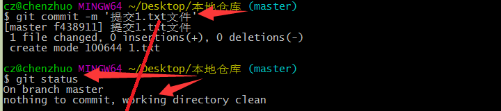
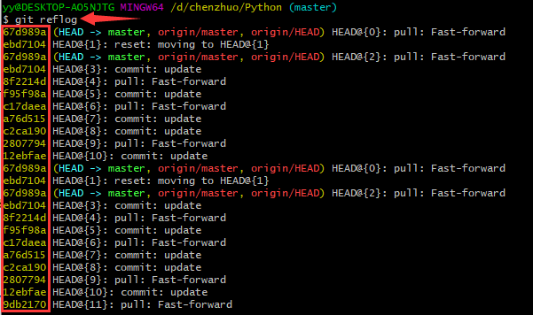
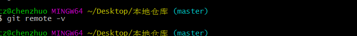
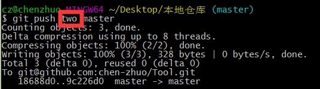

# *Git* 版本控制

**Git 是一个开源的分布式版本控制系统。**

## *Git* 介绍

学习 Git 那就首先在电脑上下载并安装 Git，下载地址：https://git-scm.com/

### Git模式

安装好Git以后会出现在点击鼠标右键的菜单栏里面。分别是：

```
Git GUI Here：图形界面模式
Git Bash Here：命令行模式
注释：这里首先推荐使用命令行模式，虽然图形界面操作更加方便，但不是每台电脑都有可视化界面供你使用！
```


### *Git* 工作

Git 分区：

工作区：**添加、编辑、修改文件等动作。**

暂存区：**暂存已经修改的文件最后统一提交带 *Git* 仓库中。**

历史区：**最终确定的文件保存到仓库，称为一个新的版本，并且对他人可见。**

Git 仓库：

本地仓库：**即工作区、暂存区、历史区的集合，这些都是在本地的。**

远程仓库：**即线上的代码托管平台，例如Github、GitLab、Gitee。**

Git 工作流：

工作流程：**工作区——>暂存区——>历史区——>远程仓库 | 本地仓库——>远程仓库**

### 常用命令

这里说点题外话，听说过Linux系统的人或多或少都听说过“林纳斯·托瓦兹”，是他开发了Linux内核，因此被称为Linux之父。然而这位大牛的代表作不止刚提到的Linux，还有一个就是我们现在讲的Git。**简单说，Linux和Git都出自同一位大牛，所以许多常用命令既适用于Linux，也适用于Git。**

```
Linux、Git常用命令：

    ls：查看当前文件夹内的文件

    pwd：查看当前所在路径
    
    cd /路径：进入指定路径
    
    cd ..：返回上层路径

    mkdir XXX：当前目录下创建一个XXX文件夹

    touch a.XXX：当前目录下生成一个a.XXX文件
    
    cat a.XXX：查看文件a.XXX的内容

    vim a.XXX：编辑文件a.XXX
        1.vim是一个编辑器
        2.按i键进入编辑模式
        3.按esc键进入底线命令模式
        4.底线命令模式下，输入:wq保存编辑并退出，输入:q!不保存编辑并退出
```

## 本地管理

### 用户配置

初次使用 Git 首先就要设置用户信息：

```
# 设置用户名chen-zhuo
git config --global user.name'用户名'

# 设置用户邮箱
git config --global user.email'邮箱'
```

通过下面命令可以查看用户信息是否配置好：

```
# 查看配置信息
git config -l

# 查看全局配置信息
git config --global -l
```


### 新建本地仓库

```
# 新建test文件夹
mkdir test

# 进入test文件夹
cd test

# 将test文件夹初始化为本地仓库
git init
```

注释：初始化为本地仓库，会在文件夹内生成一个 `.git` 文件夹，它是用来存储本地仓库数据信息的。


### 工作区修改

首先我们在初始化的仓库内部添加一个名称为 `1.txt` 的新文件，使用 `git status` 查看状态：

```
git status：查看状态
    红色(工作区)：
        红色文件名：表示工作区的修动是，文件添加
        modified 红色文件名：表示工作区的改动是，文件修改
        deleted 红色文件:表示工作区的改动是，文件删除
    绿色(暂存区)：
        绿色文件名：表示暂存区的修动是，文件添加
        modified 绿色文件名：表示暂存区的改动是，文件修改
        deleted 绿色文件:表示暂存区的改动是，文件删除
    没有文件名：表示工作区、暂存区都很干净，没有修改的内容
```

下图是有一个红色文件名，表明工作区的修改是**文件添加**：


下图是有一个**modified加红色文件名**，表明工作区的修改是**文件内容修改**：


下图是有一个**deleted加红色文件名**，表明工作区的修改是**文件删除**：


如果我们修改了文件发现不是我们想要的，可以使用如下命令丢弃工作区的改动：

```
# 丢弃仓库中所有文件的所有修改
git checkout .

# 丢弃单个文件夹内的改动
git checkout 路径/

# 丢弃指定文件的修改
git checkout 路径/文件名称
```

丢弃工作区的改动后，工作区回归未修改的状态，使用 `git status` 查看工作区就没有改动信息了：


有些时候，如果在本地编辑的过程中误删了某些文件或者文件夹，可以通过该命令来复原：


### 暂存区提交

将文件的修改添加到暂存区：

```
# 监控工作区的状态树，使用它会把工作时的所有变化提交到暂存区，包括文件内容修改(modified)以及新文件(new)，但不包括被删除的文件。
git add .
# 即git add --update的缩写，仅监控已经被add的文件（即tracked file），他会将被修改的文件提交到暂存区。add -u 不会提交新文件（untracked file）。
git add -U
# 上面两个功能的合集（git add --all的缩写）
git add -A

# 提交指定文件的修改到暂存区
git add 路径/文件名称
```

?> 提示：当文件的修改提交到暂存区后，如果后面又有新增修改，需要再次执行命令，将最新的修改提交到暂存区。

提交文件后，使用 `git status` 查看修改的状态，是绿色文件名，表明该文件的修改在暂存区：


### 历史区定版

将暂存区的修改提交到历史区进行封版：

```
# 将暂存区的所有文件提交到历史区
git commit -m '对当前修改内容的简短描述'
```

提交到历史区后，使用 `git status` 查看状态，提示工作区、暂存区干净：



### 历史版本

当修改的内容提交到历史区时，Git 会对当前的所有文件内容进行一次封版。使用下名命令可以查看历史版本的信息：

```
# 查看历史版本信息（有提交过的版本信息）
git log
```


### 版本回滚

有些时候，我们提交一些错误的修改并进行了定版，想要回到上一个未提交修改的版本，可以进行如下操作：

```
# 查看所有分支的所有操作记录（包括已经被删除的commit记录和reset的操作）
git reflog

# 回滚到指定版本
git reset --hard ID号
或者
git reset --hard HEAD@{编号}
```

下图左侧的黄色编号，就是每个版本的操作的ID号，后面的HEAD@{编号}。



## 远程管理

前面我们所有的操作都是在本地进行的，其修改内容也是放在本地的。**现在我们要将修改的内容推至线上的远程仓库里面，让所有人都能看到，前提是我们的修改已经提交到了历史区。**

### 连接远程仓库

**要想将本地仓库的内容上传到远程仓库，就需要一个链接来绑定远程仓库。**

```
# 查看本地仓库的链接
git remote -v
```

下图没有任何输出，就表示没有当前本地仓库没有链接。



```
# 本地仓库添加链接（连接名称可任意命名，一般为origin，后面加上仓库的地址）
git remote add 连接名称 仓库地址
```

下图中在GitHub里面选择了一个远程仓库，点击 `Clone or download` 复制远程仓库地址，使用上面的命令同本地仓库进行绑定：


如果想修改连接名称可以使用下面命令：

```
# 修改远程仓库的命名
git remote rename 连接名称 新连接名称
```

如果想解除与远程仓库的绑定可以使用下面命令：

```
# 移除远程仓库连接
git remote remove 连接名称
```

### 上传远程仓库

```
# 上传文件
git push 连接名称 分支名称
```


*push* 命令需要输入 *GitHub* 用户名和密码：


### 克隆远程仓库

假如上面的所有操作都是在1号电脑上进行的，现在我们换到了2号电脑，但又想接着1号电脑的进度继续修改，最常用的方法就是：**将1号电脑的本地仓库上传到远程仓库，2号电脑再把远程仓库克隆到本地。**

克隆远程仓库到本地有两种方式：**通过ssh链接克隆仓库（需要登录代码托管平台）、通过https链接克隆仓库（无需登录代码托管平台）**

```
# 克隆远程仓库（master主分支）
git clone ssh链接/https链接

# 克隆远程仓库（指定其他分支）
git clone -b 分支名称 ssh链接/https链接 
```

方式区别：使用https链接克隆的仓库，每次fetch和push代码都需要输入账号和密码，这也是https方式的麻烦之处。使用SSH克隆之前需要先配置和添加好SSH key（你必须是这个项目的拥有者才能添加SSH key），每次fetch和push代码都不需要输入账号和密码。

复制 *GitHub* 仓库的http地址：


克隆远程仓库到本地：


### 同步远程仓库

接着上面的例子，我们在2号电脑上进行了修改，现在我们又回到了1号电脑，，如果想接着2号电脑的进度继续修改，最常用的办法是：**将2号电脑的修改推送到远程仓库，将1号电脑的本地仓库与远程仓库进行同步。**

```
# 同步远程仓库（不写分支名称，默认master主分支）
git pull 连接名称 分支名称
```

假如此时1号电脑上的本地仓库也有改动，进行 `git pull` 同步的话就会报错 `error: cannot pull with rebase: You have unstaged changes.` ，就可以使用下面命令进行同步：

```
# 同步远程仓库
git pull --rebase 连接名称 要拉取的线上分支名称
```

### 解决冲突

`git pull --rebase` 不是万能的，**如果远程仓库同步的内容和本地仓库修改的内容是一个地方，就有可能产生冲突。**例如：甲乙两人都克隆了线上同一个分支，甲修改了A文件中的变量B，并推送到了远程仓库，这个时候乙也修改了A文件中的变量B，**乙开始提交前需要先同步远程仓库，这个时候甲和乙的修改内容就会产生冲突，因此就需要乙来解决冲突。**

```
# 同步远程仓库，发现有冲突报错
git pull --rebase 连接名称 要拉取的线上分支名称

# 查看冲突地方
git diff

# 去到冲突的地方解决冲突再次进行提交
git add .
git rebase --continue
git push -f origin 要提交的分支名称
```

## 分支管理

在日常的程序员工作中，并不是一个人就完成了所有的开发，而是多人协作开发来管理代码，因此就必须要学习分支管理了。

**分支：从一个系统或主体中分出来的部分，这里讲的分支就是代码的不同版本。**例如，同一套代码，A拷贝后修改了文件file1，这就有了新的A_branch分支，B拷贝后修改了文件file2，这就有了新的B_branch分支。

**在多人协作开发中，一般会有多个分支。**分支的命名通常为：

```
master（主分支）
dev（开发分支）
...（其他分支）
```

!> 注意：无论有多少个分支，名称通常都会有一个名称为master的主分支。

### 查看|新建

```
# 查看本地所有分支
git branch
```

**下图前面*号和绿色字体分支代表当前所在的分支，后面的括号也表明了所在的分支。**


```
# 查看全部分支
git branch -a
```

列出所有分支了，**其中上方的是本地的分支，下方的有remotes/origin开头的就是远程分支。**


```
# 新建分支
git branch 新建分支名称

# 新建分支并切换到新建的分支
git checkout -b 新建分支名称
```

**在分支A中新建分支B，分支B就是分支A的拷贝版。**


!> 注意：新建分支不可和已有分支重名，否则会报创建分支失败的错误。

### 切换|提交

```
# 切换分支
git checkout 要切换到的分支

# 强制切换分支
git checkout -f  要切换到的分支
```
这里有一点需要注意的是，下图在来回切换分支的过程当中，总是会提示一个M（当前分支存在修改），其原因在于：**工作区和暂存区都是公共区域，只要没有commit，任何修改都是在全局的，是没有被纳入版本管理的。**


如果在当前分支有修改后，想切换到另一个分支，有下面两种办法：

```
方法一：将当前分支的修改提交历史区再切换分支
git add .
git commit -m '提交描述'
git checkout 要切换到的分支

方法二：舍弃修改再切换分支
git checkout .（舍弃当前分支的所有文件修改）
git checkout 要切换到的分支
或者直接
git checkout -f 舍弃所有修改要切换到的分支
```

现在我们切换到新建的new分支，做出修改后并提交。

```
# 将修改的文件从工作区提交到暂存区
git add .
```


```
# 将修改的文件从暂存区提交到历史区
git commit -m '提交描述'
```


```
# 若后面还有追加修改的文件，再次提交
git add .

# 新增修改到历史区需要确认追加的修改，输入“:wq”保存退出即可
git commit --amend
```


```
# 提交需要合并分支的请求到线上
git push -f origin 要提交的分支名称
```


### 合并|删除

提交new分支后，可以看到线上已经多出一个new分支：


点击Pull requests，点击 Compare & Pull requests。


进入页面后，查看是否可以合并，填写合并的请求描述，点击Create pull request。


默认进入到讨论板块页面，这里可以进行讨论交流：


提交板块页面可以看到提交的信息：


检查板块可以检查提交的代码：


修改板块可以对照修改的内容：


确认无误后，回到讨论板块，点击 Merge pull request：


点击 Confirm merge 确认合并：


确认合并后，点击 Delete branch 可以安全的删除new分支了：


回到仓库页会提示合并分支的请求已完成：


再查看分支也只有master分支了，说明new分支已经成功与master主分支进行了合并：


假如合并以后，没有在网站上删除new分支，我们还可以通过命令来删除远程的new分支：

```
# 删除远程分支
git push origin --delete 要删除的远程分支名称
```
确认远程的new分支删除以后，这下可以删除我们本地的new分支了：

```
提示：删除的分支不能是当前所在分支，即不能在new分支里面删除new分支，只能切换到其他分支中再删除new分支。

# 切换到其他分支
git checkout 分支名称

# 删除分支（如果包含了还未合并的工作或没有对应的远程分支会失败）
git branch -d 要删除的分支名称

# 强行删除分支（删除分支并丢掉未提交的内容）
git branch -D 要删除的分支名称
```


### 拉取|改名

假如远程仓库有master主分支、其他分支，而本地仓库只有master主分支，如果需要使用其他分支可以使用下面命令进行创建拉取：

```
# 拉取线上分支
git fetch 连接名称 远程仓库分支:本地仓库分支

# 强制拉取线上分支
git fetch -f 连接名称 远程仓库分支:本地仓库分支

# 举例：拉取远程仓库branch1分支在本地仓库创建branch2分支
git fetch -f origin branch1:branch2
```
有时候我们需要修改分支的名称可以使用下面命令：

```
# 分支改名（将master改名为new_master）
git branch -m master new_master
```


## 进阶操作

### 忽略验证

有些时候，我们在克隆仓库文件或者推送修改时，会提示如下错误：`OpenSSL SSL_read: Connection was reset, errno 10054`。


**这因为git会进行一个SSL证书验证的过程，如果验证失败就会报该错误。**我们可以通过如下设置，来忽略该错误：`git config --global http.sslVerify "false"`


### 忽略文件

**在使用Git时，默认会将下面所有文件都纳入管理，但有些文件是无需纳入的管理，也不希望它们出现在未跟踪文件列表，例如：日志文件、临时文件、编译产生的中间文件等等。此时我们可以创建一个名为 `.gitignore` 的文件，在里面列出要忽略的文件或文件夹，Git会根据内容判断是否将文件或文件夹添加到版本控制中。**其中 `.gitignore` 文件格式规范：

```
1.所有空行或者以注释符号#开头的行都会被 Git 忽略
2.可以使用标准的glob模式匹配
3.匹配模式最后跟斜杠/说明要忽略的是目录
4.要忽略指定模式以外的文件或目录，可以在模式前加上感叹号(!)进行取反
```

所谓的 glob 模式是指 shell 所使用的简化了的正则表达式，匹配规则如下：

```
"*"：星号匹配零个或多个任意字符
[]：匹配任何一个列在方括号中的字符，如[ab]匹配a或者匹配b
"?"：问号匹配一个任意字符
[n-m]：匹配所有在这两个字符范围内的字符，如[0-9]表示匹配所有0到9的数字

示例：
logs/：忽略当前路径下的logs目录，包含logs下的所有子目录和文件
/logs.txt：忽略根目录下的logs.txt文件
*.class：忽略所有后缀为.class的文件
!/classes/a.class：不忽略classes目录下的a.class文件
tmp/*.txt：只忽略tmp目录下的.txt文件
**/foo：可以忽略/foo, a/foo, a/b/foo等
```

除了可以在项目中定义 `.gitignore` 文件外，还可以设置全局的 `.gitignore` 文件来管理所有Git项目的行为。这种方式在不同的项目开发者之间是不共享的，是属于项目之上Git应用级别的行为。可以在任意目录下创建相应的 `.gitignore` 文件，然后再使用以下命令配置Git：

```
git config --global core.excludesfile ~/.gitignore
```

Python项目 `.gitignore` 文件示例：

```
venv
.idea
*.pyc
__pycache__

### VisualStudioCode ###
.vscode/*
.vscode/**
!.vscode/settings.json
!.vscode/tasks.json
!.vscode/launch.json
!.vscode/extensions.json

### VisualStudioCode Patch ###
# Ignore all local history of files
.history
```
`.gitignore` 只能忽略那些原来没有被track的文件，如果某些文件已经被纳入了版本管理中，则修改 `.gitignore` 是无效的，解决方法就是先把本地缓存删除(改变成未track状态)，然后再提交：

```
# 同时从工作区和索引中删除文件
git rm 文件名

# 只在索引中删除文件，但是本地文件还存在，只是不希望这个文件被纳入版本管理
git rm --cached 文件名

# 删除本地全部缓存
git rm -r --cached .

# 再提交
git add .
git commit -m "msg"
```

### 身份认证

每一次推送更新到远程仓库都需要进行登录是一个麻烦的操作。在前面提到过一种不用登录就能更新的方法就是使用 *SSH Key* 来进行身份认证。首先我们需要在本地创建 *SSH Key*：

```
# 输入该命令，一路回车，生成公钥和密钥文件
ssh-keygen -t rsa -C "账号@qq.com"
```


找到文件生成的地方，**当中有两个文件个就是 *SSH Key* 的秘钥对，*id_rsa* 是私钥，不能泄露出去，*id_rsa.pub* 是公钥，可以放心地告诉任何⼈**：


打开 *id_rsa.pub* 文件并复制其中的内容：


打开并登录 *GitHub* 网站在 *settings* 中新增 *New SSH key*：


将复制的内容粘贴其中，并添加上标题，点击 *Add SSH key*，网站上的账户就成功添加了公钥：


输入命令尝试 *SSH* 连接，就成功连接上了：

```
ssh -T git@github.com
```


这个时候我们上传文件使用远程仓库的 *SSH* 链接：


将远程仓库的 *SSH* 添加到连接列表中：


上传文件我们就通过 *SSH* 来传递文件，就不用输入密码了：



?> *GitHub* 允许你添加多个 *Key*。假定你有若干电脑，你⼀会儿在公司提交，⼀会儿在家里提交，只要把每台电脑的 *Key* 都添加到 *GitHub*，就可以在每台电脑上往 *GitHub* 推送 了。

?> *Git* 的克隆仓库可以直接使用远程仓库的 *SSH* 地址。

?> 更新新建的仓库最好先将仓库克隆到本地再更新，有 *SSH* 到时候更新完成，直接 *git push* 就好啦。

