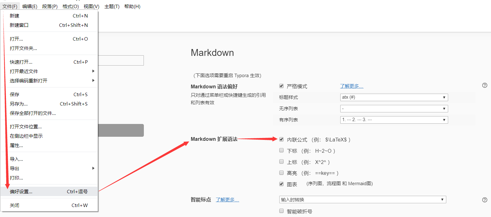

# LaTeX排版

### LaTeX简介

**LaTeX（LATEX，音译“拉泰赫”）是一种基于ΤΕΧ的排版系统**，由美国计算机学家莱斯利·兰伯特（Leslie Lamport）在20世纪80年代初期开发，利用这种格式，即使使用者没有排版和程序设计的知识也可以充分发挥由TeX所提供的强大功能，能在几天，甚至几小时内生成很多具有书籍质量的印刷品。**对于生成复杂表格和数学公式，这一点表现得尤为突出，因此它非常适用于生成高印刷质量的科技和数学类文档**。

### 符号大全


### Typora支持

Typora 就是在前面基础部分建议安装的软件，主要用途就是用来写文档，它支持Markdown语法(前面基础部分有，这里我就不演示了)，还支持LaTeX排版，支持的方式就是：**公式块+LaTeX符号**。

公式块的快捷键：`Ctrl+Shift+M`（快间公式）

数学公式有两种形式： *Lnline*（行间公式）和 *Display*（快间公式）

##### 行间公式

*Lnline*（行间公式）：**在正文中插入数学公式，用 `$` 将公式括起来**

```
阿尔法+贝塔 == $\alpha+\beta$
```

阿尔法+贝塔 == $\alpha+\beta$

**注意：使用行间公式需要在Typora“文件”——“偏好设置”——“Markdown扩展语法”——“内联公式”(打勾)。**



##### 快间公式

***Display*（快间公式）：独立排列的公式，用 `$$`将公式括起来，默认显示在行中间。**

```
$$
阿尔法+贝塔 == \alpha+\beta
$$		
```

$$
阿尔法+贝塔 == \alpha+\beta
$$

##### 复杂公式

明白怎样组合公式块和LaTeX符号后，即使再复杂的公式我们也可以写出来。

均方误差方程式：

```
$$
J(/theta) = \frac{1}{2m}\sum_{i=0}^m(y^i - h_\theta(x^i))^2
$$
```

$$
J(\theta) = \frac{1}{2m}\sum_{i=0}^m(y^i - h_\theta(x^i))^2
$$

### 网页支持

有了Typora文档上的支持，但文档只能本地浏览，上传到Github，网上的文档不支持LaTeX就直接把公式的源码暴露，这样不利于阅读。这个时候，我们就要寻找一种网页上的支持。

##### GithubPage

我们在基础部分讲过，GithubPage 可以将 Github 上的文档以网页形式浏览，不仅有利于我们阅读文档，而且还可以通过目录快速切换阅读文档，就像读电子书一样。

至于怎么配置 GithubPage ，已经在基础部分讲过，这里就不再赘述。

##### KaTeX渲染

有了GithubPage网页浏览还不够，接下来我们需要在GithubPage网页框架中引入能渲染公式块的Js代码和CSS样式。

*KaTeX* 数学公式渲染库：

```html
  <script src="//cdn.jsdelivr.net/npm/docsify-katex@latest/dist/docsify-katex.js"></script>
  <!-- or <script src="//cdn.jsdelivr.net/gh/upupming/docsify-katex/dist/docsify-katex.js"></script> -->
  <link
    rel="stylesheet"
    href="//cdn.jsdelivr.net/npm/katex@latest/dist/katex.min.css"
  />
```

我的GithubPage网页用的是 docsify 框架，将上面的*KaTeX* 数学公式渲染库加入到框架代码如下：

```html
<!DOCTYPE html>
<html lang="en">
<head>
  <meta charset="UTF-8">
  <title>Math</title>
  <meta http-equiv="X-UA-Compatible" content="IE=edge,chrome=1" />
  <meta name="description" content="Description">
  <meta name="viewport" content="width=device-width, user-scalable=no, initial-scale=1.0, maximum-scale=1.0, minimum-scale=1.0">
  <link rel="stylesheet" href="//unpkg.com/docsify/lib/themes/vue.css">
</head>
<body>
  <div id="app"></div>
  <script>
    window.$docsify = {
      name: 'Math',
      loadSidebar: true,
      subMaxLevel: 5,
      alias: {
        '/.*/_sidebar.md': '/_sidebar.md'
      }
    }
  </script>
  <!-- CDN files for docsify-katex -->
  <script src="//cdn.jsdelivr.net/npm/docsify-katex@latest/dist/docsify-katex.js"></script>
  <!-- or <script src="//cdn.jsdelivr.net/gh/upupming/docsify-katex/dist/docsify-katex.js"></script> -->
  <link rel="stylesheet" href="//cdn.jsdelivr.net/npm/katex@latest/dist/katex.min.css"
  />
  <!-- Put them above docsify.min.js -->
  <script src="//cdn.jsdelivr.net/npm/docsify@latest/lib/docsify.min.js"></script>
</body>
</html>
```

**这样，在GithubPage浏览端看到的文档数学公式就是经过渲染的数学公式了。**