# *Markdown* 语法

### *Windows* 快捷键

讲解 *Markdown* 之前，先来熟悉一下快捷键，毕竟写文档更多的是键盘操作，快捷键能提高写文档的效率。

##### *Ctrl* 组合键

*Ctrl* 在计算机中称为“控制键”，全名为 *control*，中文意思为“控制”。

```
    Ctrl+A  ---  全选（选择当前页面所有内容）
    
    Ctrl+B  ---  加粗（选择当前字体加粗）
    
    Ctrl+C  ---  复制（复制当前所选的内容）
    
    Ctrl+D  ---  收藏（浏览器中添加收藏）
    
    Ctrl+E  ---  搜索（浏览器中或文件夹内搜索）
    
    Ctrl+F  ---  查找（查找当前页面所有内容）
    
    Ctrl+G  ---  定位（定位内容所在区域）
    
    Ctrl+H  ---  替换（查找内容和替换内容）
    
    Ctrl+I  ---  斜体（选择当前字体改变为斜体）
    
    Ctrl+J  ---  下载（浏览器中下载的内容）
    
    Ctrl+K  ---  搜索（浏览器中搜索）
    
    Ctrl+L  ---  左对齐或选中当前行（不同软件功能不同）
    
    Ctrl+M  ---  左缩进（段落至左边界起始位置）
    
    Ctrl+N  ---  新建（新建空白文件或空白浏览器窗口或当前路径窗口）
    
    Ctrl+O  ---  打开（剪切当前所选内容）
    
    Ctrl+P  ---  打印（打印当前文件）
	
    Ctrl+Q  ---  清除（清除选择文本的字体格式）
	
    Ctrl+R  ---  右对齐（段落右侧对齐）
    
    Ctrl+S  ---  保存（保存内容）
    
    Ctrl+T  ---  建表（Typora中新建表格）
    
    Ctrl+U  ---  下划线（选中字体添加下划线）
    
    Ctrl+V  ---  粘贴（粘贴所复制或者剪切的内容）
    
    Ctrl+W  ---  关闭窗口（浏览器中关闭当前窗口）
    
    Ctrl+X  ---  剪切（剪切所选择的内容）
    
    Ctrl+Y  ---  前进（配合Ctrl+Z使用，前进到下一步操作）
    
    Ctrl+Z  ---  后退（后退到上一步操作）
    
    Ctrl+End  ---  跳转至文档结尾
    
    Ctrl+Home  ---  跳转至文档开头
    
    Ctrl+鼠标滑轮  ---  放大缩小（适用于网页、word文档）
    
    Ctrl+鼠标左键  ---  选择多个（按住Ctrl，点击鼠标左键，可以选择多个目标或设置多个光标）
```

##### *Shift* 组合键

*Shift* 在计算机中称为“转换键”，用于中英文转换，它作为辅助控制键，可以和其它的键一起使用。

```
    Shift  ---  转换（按一次，中英文输入切换；按住不放，英文字母大写）    
    
    Shift+Ctrl  ---  切换输入法（在不同输入法之间切换，例：QQ输入法，搜狗输入法）
    
    Shift+Ctrl+Z  ---  反撤销（恢复上一步操作，类似Ctrl+Y）
    
    Shift+Delete  ---  永久删除文件（不放入回收站）
    
    Shift+鼠标左键  ---  连续选择（选择两个不相邻文件时，也会将中间的目标一起选择）
    
    Shift+鼠标右键  ---  快速打开当前位置命令行窗口
```

##### *Alt* 组合键

*Alt* 在计算机中称为“交替换档键”，中文意思为“改变”。

```
    Alt+F4  ---  快速关闭（快速关闭当前程序，若有未保存内容会提示）
    
    Alt+Tab  ---  切换活动窗口（在不同程序间切换活动窗口）
    
    Alt+Ctrl+A  ---  截屏（登录QQ才能用，截图菜单要先按住alt，再按住Ctrl，点击出菜单，最后按住A）
  
    Alt+Ctrl+Delete  ---  任务管理器
```

##### *Win* 组合键

*win* 即 *Windows* 键，在计算机键盘左下角 *Ctrl* 和 *alt* 之间的按键。

```
    Win+E  ---  打开“我的电脑”
    
    Win+R  ---  打开“运行”
    
    Win+D  ---  显示桌面
    
    Win+M  ---  最小化所有窗口
```

### *Markdown*语法

***Markdown* 是一种用文本编辑器编写的标记语言，通过简单的标记语法使普通文本内容具有一定的样式。**

##### *Typora* 编辑器

*[Typora](https://www.typora.io/)* 是一款轻便简洁的 ***Markdown* 编辑器**。

先下载安装 *Typora* ，再新建一个文本文件，即`新建文本文档.txt`，修改后缀名为`md`，即`新建文本文档.md`，点击打开就可以用 *Markdown*  语法来写文档了。

?> 文件后缀名怎么显示？移步至https://jingyan.baidu.com/article/25648fc174589b9191fd00ec.html

?> *Github* 上的文件想要展示 *Markdown* 语法效果，需要将文件的后缀名为 `.md` 。

##### 界面符号

文档界面如下图所示：

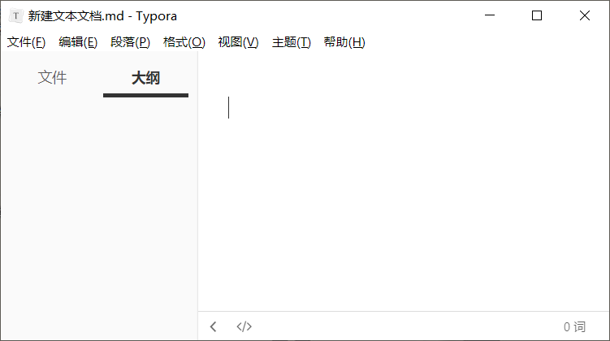

**保存**：标题栏中文件名称最后面黑色实心圆点，代表当前内容未保存，`ctrl+s` 保存后，黑色实心圆点便消失。

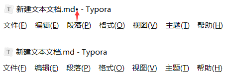

**边侧栏**：左下角第一个符号 `<` 或 `o`，显示 / 隐藏侧边栏。

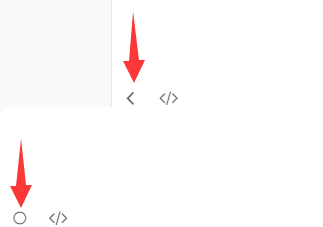

**文件栏**：显示当前文件所在的路径以及其他的文本类型文件。

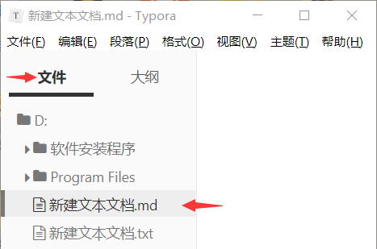

**大纲栏**：显示当前文本文件中的所有不同等级的标题。

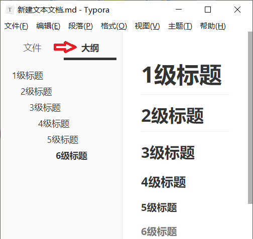

**源代码模式**：左下角第二个符号 `</>`，启用 / 退出源代码模式。快捷键：`Ctrl+/`

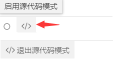

**启用源代码模式**：显示修饰字体样式的 *Markdown* 语法符号。

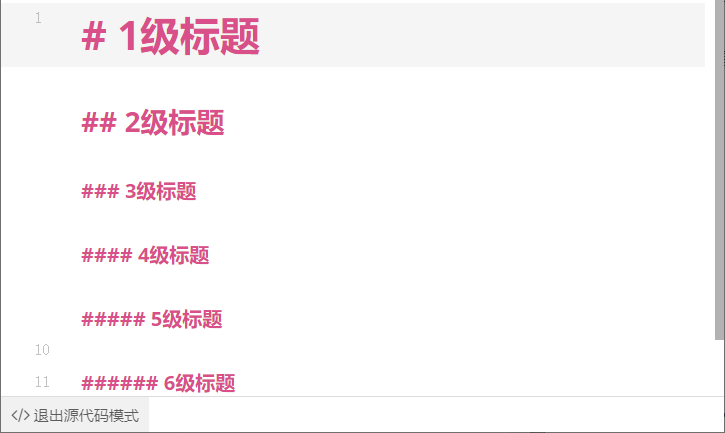

**非源代码模式**：显示通过 *Markdown* 语法修饰过后的字体样式。


**统计检查**：界面右下角可选择拼写检查及字数统计。

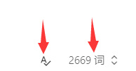

##### 字体样式

|  字体样式  |     快捷键     |           源代码            |      效果      |
| :--------: | :------------: | :-------------------------: | :------------: |
|    斜体    |    `Ctrl+I`    |           \*斜体*           |     *斜体*     |
|    加粗    |    `Ctrl+B`    |         \*\*加粗\**         |    **加粗**    |
|  斜体加粗  |   `Ctrl+B+I`   |      \*\*\*斜体加粗***      | ***斜体加粗*** |
|   删除线   | `Alt+Shift+5`  |        \~\~删除线\~~        |   ~~删除线~~   |
|   下划线   |    `Ctrl+U`    |       \<u>下划线\</u>       | <u>下划线</u>  |
|    引用    |   `>+Space`    |              >              |     > 引用     |
|   分割线   |                | --- 、----、\*\**、\*\*\*** |                |
|  文本居中  |                | \<center>文本居中\</center> |    文本居中    |
| 单行代码块 |                |        \`单行代码块`        |  `单行代码块`  |
| 多行代码块 | `Ctrl+Shift+K` |      \```多行代码块```      |                |
|    表情    |                |          :English:          |    :smiley:    |

##### 标题等级

标题一共有6级，等级越低，标题的字体就会越大，在边侧栏的大纲里面的位置就会越靠前。

| 标题等级 |  快捷键  |     源代码      |
| :------: | :------: | :-------------: |
|    1     | `Ctrl+1` |   \# 1级标题    |
|    2     | `Ctrl+2` |   \## 2级标题   |
|    3     | `Ctrl+3` |  \### 3级标题   |
|    4     | `Ctrl+4` |  \#### 4级标题  |
|    5     | `Ctrl+5` | \##### 5级标题  |
|    6     | `Ctrl+6` | \###### 6级标题 |

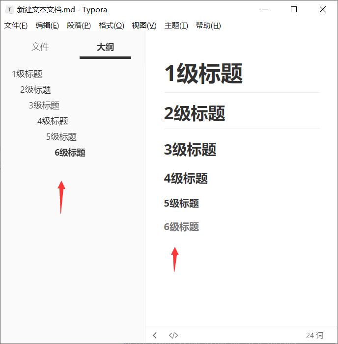

##### 插入表格

插入表格的快捷键：`Ctrl+T`

源代码：

```
| 左对齐 |  居中  | 右对齐 |
| ------ | :----: | -----: |
| 向左看 | 向前看 | 向右看 |
```

| 左对齐 |  居中  | 右对齐 |
| ------ | :----: | -----: |
| 向左看 | 向前看 | 向右看 |

!> 相邻表格之间不能合并，一列只有一种对齐方式。

##### 序列列表

列表就是在每行的行首进行字符标注，标注一次后下面每一次换行都会自动生成标注，两次 `Enter `  键跳出列表。

**无序列表**：前面以实心点进行标注，输入 `-Space键` 或 `*Space键`。

```
- Hello 
- World
```

- Hello 
- World

**有序列表**：前面以数字进行标注，输入 `数字.Space键` 。

```
1. Hello
2. World
```

1. Hello
2. World

##### 代码块

代码块支持多种编程语言，点击代码块在右下方 `选择语言` 中填写语言或者直接输入3个`加上语言(\```python)，即可对应不同的主题。

快捷键：`Ctrl+Shift+K`

设置代码块行号：文件——>偏好设置——>代码块——>显示行号

*Python*

```python
def func():
	print('Hello world!')
```

*Java*

```java
package com.hello;
 
public class HelloWorld {
	public static void main(String[] args) {
		System.out.println("Hello World!");
	}
}
```

*JavaScript*

```js
<!DOCTYPE html>
<html lang="en">
<head>
    <meta charset="UTF-8">
    <title></title>
    <script type="text/javascript">
		alret("Hello World!");
    </script>
</head>
<body>
</body>
</html>
```

*HTML*

```html
<html>
      <head>
          <title></title>
    </head>
      <body>
        Hello World!
      </body>
</html>
```

*Go*

```go
package main

import "fmt"

func main() {
    fmt.Print("hello world")
}
```

*C*

```c
#include <stdio.h>
int main()
{
	printf("Hello,World!\n");
	return 0;
}
```


##### 公式块

*Typora* 对 *LaTeX* （一种基于ΤΕΧ的排版系统）进行了很好的支持。

快捷键：`Ctrl+Shift+M`

数学公式有两种形式： *Lnline*（行间公式）、*Display*（快间公式）

**行间公式**

*Lnline*（行间公式）：在正文插入数学公式，用 `$` 将公式括起来。

阿尔法+贝塔 == $\alpha+\beta$

```
阿尔法+贝塔 == $\alpha+\beta$
```

**快间公式**

*Display*（快间公式）：独立排列的公式，用 `$$`将公式括起来，默认显示在行中间。

$$
阿尔法+贝塔 == \alpha+\beta
$$

```
$$
阿尔法+贝塔 == \alpha+\beta
$$		
```

!> *Github* 上的文档不支持公式块即 *LaTeX* 数学公式，展示数学公式最好使用网页加载 *JS* 和 *CSS* 来展示。

##### 转义符

*Markdown* 语法实际上就是让各种符号组合形成具有修饰功能的语法，如果只是单纯的需要符号组合不需要修饰功能，就要在**每个符号前面**添加一个转义字符 `\` 。

!> 连续使用转义符 `\` 和 `，可能会导致 *JS* 和 *CSS* 不能正确渲染数学公式。

### 引用图片

*Typora* 支持 `.jpg`  `.jpeg`  `.gif`  `.png` 格式图片。

图片加载有两种方式：网络引用、本地引用。

图片加载格式：``，快捷键 `Ctrl+Shift+I`。

**网络引用**：通过复制或拖拽浏览器中的图片，来引用图片的网络地址加载图片。

优点：在任何地方都能加载图片。

缺点：图片网络地址失效时，图片也就消失。

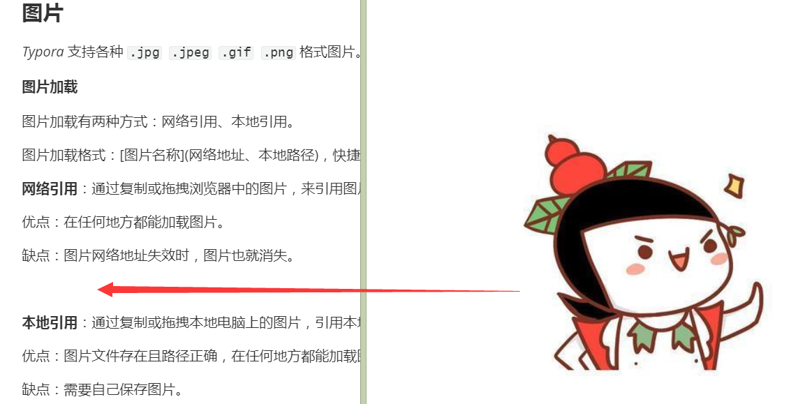


**本地引用**：通过复制或拖拽本地电脑上的图片，引用本地电脑上的图片的相对或绝对路径来加载图片。

优点：图片文件存在且路径正确，在任何地方都能加载图片，且图片不会消失（除非删除图片）。

缺点：需要自己保存图片，占用空间。


##### 引用路径

**引用路径**：即图片的所在位置，点击图片即可查看图片的网络地址或本地路径。

**网络地址**：图片所在的网络地址。

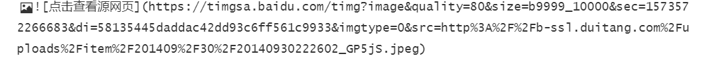

**本地绝对路径**：图片所在电脑里面的绝对位置。

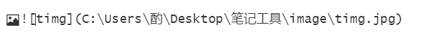

本地相对路径：图片相对于当前文件路径下的地址。

设置相对路径：`编辑——>图片工具——>全局图像设置——>优先使用相对路径`。


?> 将所有图片放置在一个文件夹内，方便统一管理。

?> 加载图片尽量不使用绝对路径，一旦图片文件夹位置发生变动，使用绝对路径的图片加载都将失效。

!> 绝对地址用斜杠 `\`，相对地址用反斜杠 `/`。

##### 网络微博表情

![[微笑]](https://img.t.sinajs.cn/t4/appstyle/expression/ext/normal/e3/2018new_weixioa02_org.png)![[可爱]](https://img.t.sinajs.cn/t4/appstyle/expression/ext/normal/09/2018new_keai_org.png)![[太开心]](https://img.t.sinajs.cn/t4/appstyle/expression/ext/normal/1e/2018new_taikaixin_org.png)![[鼓掌]](https://img.t.sinajs.cn/t4/appstyle/expression/ext/normal/6e/2018new_guzhang_org.png)![[嘻嘻]](https://img.t.sinajs.cn/t4/appstyle/expression/ext/normal/33/2018new_xixi_org.png)![[哈哈]](https://img.t.sinajs.cn/t4/appstyle/expression/ext/normal/8f/2018new_haha_org.png)![[笑cry]](https://img.t.sinajs.cn/t4/appstyle/expression/ext/normal/4a/2018new_xiaoku_thumb.png)![[挤眼]](https://img.t.sinajs.cn/t4/appstyle/expression/ext/normal/43/2018new_jiyan_org.png)![[馋嘴]](https://img.t.sinajs.cn/t4/appstyle/expression/ext/normal/fa/2018new_chanzui_org.png)![[黑线]](https://img.t.sinajs.cn/t4/appstyle/expression/ext/normal/a3/2018new_heixian_org.png)![[汗]](https://img.t.sinajs.cn/t4/appstyle/expression/ext/normal/28/2018new_han_org.png)![[挖鼻]](https://img.t.sinajs.cn/t4/appstyle/expression/ext/normal/9a/2018new_wabi_thumb.png)![[哼]](https://img.t.sinajs.cn/t4/appstyle/expression/ext/normal/7c/2018new_heng_org.png)![[怒]](https://img.t.sinajs.cn/t4/appstyle/expression/ext/normal/f6/2018new_nu_org.png)![[委屈]](https://img.t.sinajs.cn/t4/appstyle/expression/ext/normal/a5/2018new_weiqu_org.png)![[可怜]](https://img.t.sinajs.cn/t4/appstyle/expression/ext/normal/96/2018new_kelian_org.png)![[失望]](https://img.t.sinajs.cn/t4/appstyle/expression/ext/normal/aa/2018new_shiwang_org.png)![[悲伤]](https://img.t.sinajs.cn/t4/appstyle/expression/ext/normal/ee/2018new_beishang_org.png)![[泪]](https://img.t.sinajs.cn/t4/appstyle/expression/ext/normal/6e/2018new_leimu_org.png)![[允悲]](https://img.t.sinajs.cn/t4/appstyle/expression/ext/normal/83/2018new_kuxiao_org.png)![[害羞]](https://img.t.sinajs.cn/t4/appstyle/expression/ext/normal/c1/2018new_haixiu_org.png)![[污]](https://img.t.sinajs.cn/t4/appstyle/expression/ext/normal/10/2018new_wu_org.png)![[爱你]](https://img.t.sinajs.cn/t4/appstyle/expression/ext/normal/f6/2018new_aini_org.png)![[亲亲]](https://img.t.sinajs.cn/t4/appstyle/expression/ext/normal/2c/2018new_qinqin_org.png)![[色]](https://img.t.sinajs.cn/t4/appstyle/expression/ext/normal/9d/2018new_huaxin_org.png)![[憧憬]](https://img.t.sinajs.cn/t4/appstyle/expression/ext/normal/c9/2018new_chongjing_org.png)![[舔屏]](https://img.t.sinajs.cn/t4/appstyle/expression/ext/normal/3e/2018new_tianping_org.png)![[坏笑]](https://img.t.sinajs.cn/t4/appstyle/expression/ext/normal/4d/2018new_huaixiao_org.png)![[阴险]](https://img.t.sinajs.cn/t4/appstyle/expression/ext/normal/9e/2018new_yinxian_org.png)![[笑而不语]](https://img.t.sinajs.cn/t4/appstyle/expression/ext/normal/2d/2018new_xiaoerbuyu_org.png)![[偷笑]](https://img.t.sinajs.cn/t4/appstyle/expression/ext/normal/71/2018new_touxiao_org.png)![[酷]](https://img.t.sinajs.cn/t4/appstyle/expression/ext/normal/c4/2018new_ku_org.png)![[并不简单]](https://img.t.sinajs.cn/t4/appstyle/expression/ext/normal/aa/2018new_bingbujiandan_org.png)![[思考]](https://img.t.sinajs.cn/t4/appstyle/expression/ext/normal/30/2018new_sikao_org.png)![[疑问]](https://img.t.sinajs.cn/t4/appstyle/expression/ext/normal/b8/2018new_ningwen_org.png)![[费解]](https://img.t.sinajs.cn/t4/appstyle/expression/ext/normal/2a/2018new_wenhao_org.png)![[晕]](https://img.t.sinajs.cn/t4/appstyle/expression/ext/normal/07/2018new_yun_org.png)![[衰]](https://img.t.sinajs.cn/t4/appstyle/expression/ext/normal/a2/2018new_shuai_org.png)![[骷髅]](https://img.t.sinajs.cn/t4/appstyle/expression/ext/normal/a1/2018new_kulou_org.png)![[嘘]](https://img.t.sinajs.cn/t4/appstyle/expression/ext/normal/b0/2018new_xu_org.png)![[闭嘴]](https://img.t.sinajs.cn/t4/appstyle/expression/ext/normal/62/2018new_bizui_org.png)![[傻眼]](https://img.t.sinajs.cn/t4/appstyle/expression/ext/normal/dd/2018new_shayan_org.png)![[吃惊]](https://img.t.sinajs.cn/t4/appstyle/expression/ext/normal/49/2018new_chijing_org.png)![[吐]](https://img.t.sinajs.cn/t4/appstyle/expression/ext/normal/08/2018new_tu_org.png)![[感冒]](https://img.t.sinajs.cn/t4/appstyle/expression/ext/normal/40/2018new_kouzhao_org.png)![[生病]](https://img.t.sinajs.cn/t4/appstyle/expression/ext/normal/3b/2018new_shengbing_org.png)![[拜拜]](https://img.t.sinajs.cn/t4/appstyle/expression/ext/normal/fd/2018new_baibai_org.png)![[鄙视]](https://img.t.sinajs.cn/t4/appstyle/expression/ext/normal/da/2018new_bishi_org.png)![[白眼]](https://img.t.sinajs.cn/t4/appstyle/expression/ext/normal/ef/2018new_landelini_org.png)![[左哼哼]](https://img.t.sinajs.cn/t4/appstyle/expression/ext/normal/43/2018new_zuohengheng_org.png)![[右哼哼]](https://img.t.sinajs.cn/t4/appstyle/expression/ext/normal/c1/2018new_youhengheng_org.png)![[抓狂]](https://img.t.sinajs.cn/t4/appstyle/expression/ext/normal/17/2018new_zhuakuang_org.png)![[怒骂]](https://img.t.sinajs.cn/t4/appstyle/expression/ext/normal/87/2018new_zhouma_org.png)![[打脸]](https://img.t.sinajs.cn/t4/appstyle/expression/ext/normal/cb/2018new_dalian_org.png)![[顶]](https://img.t.sinajs.cn/t4/appstyle/expression/ext/normal/ae/2018new_ding_org.png)![[互粉]](https://img.t.sinajs.cn/t4/appstyle/expression/ext/normal/86/2018new_hufen02_org.png)![[钱]](https://img.t.sinajs.cn/t4/appstyle/expression/ext/normal/a2/2018new_qian_org.png)![[哈欠]](https://img.t.sinajs.cn/t4/appstyle/expression/ext/normal/55/2018new_dahaqian_org.png)![[困]](https://img.t.sinajs.cn/t4/appstyle/expression/ext/normal/3c/2018new_kun_org.png)![[睡]](https://img.t.sinajs.cn/t4/appstyle/expression/ext/normal/e2/2018new_shuijiao_thumb.png)![[吃瓜]](https://img.t.sinajs.cn/t4/appstyle/expression/ext/normal/01/2018new_chigua_org.png)![[doge]](https://img.t.sinajs.cn/t4/appstyle/expression/ext/normal/a1/2018new_doge02_org.png)![[二哈]](https://img.t.sinajs.cn/t4/appstyle/expression/ext/normal/22/2018new_erha_org.png)![[喵喵]](https://img.t.sinajs.cn/t4/appstyle/expression/ext/normal/7b/2018new_miaomiao_org.png)

##### 本地动态图片


### 超链接

超链接格式：\[超链接名](超链接地址 )，快捷键`Ctrl+K`。

##### 网址超链接

[谷歌](http://blogsearch.google.com.hk/)源代码：`[谷歌](http://blogsearch.google.com.hk/)`

[百度](https://www.baidu.com)源代码：`[百度](https://www.baidu.com)`

##### 文件超链接

文件绝对地址：[文件](C:\Users\酌\Desktop\笔记工具\Readme.txt)源代码：\[文件](C:\Users\酌\Desktop\笔记工具\Readme.txt)

文件相对地址：[文件](\Readme.txt)源代码：\[文件](/Readme.txt)

